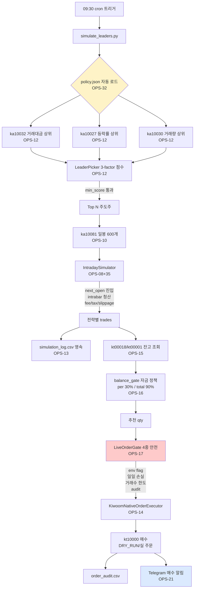
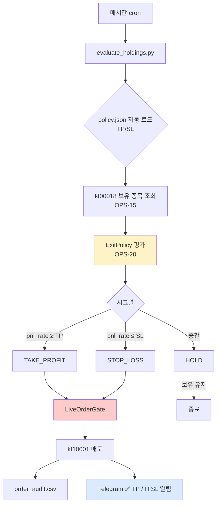
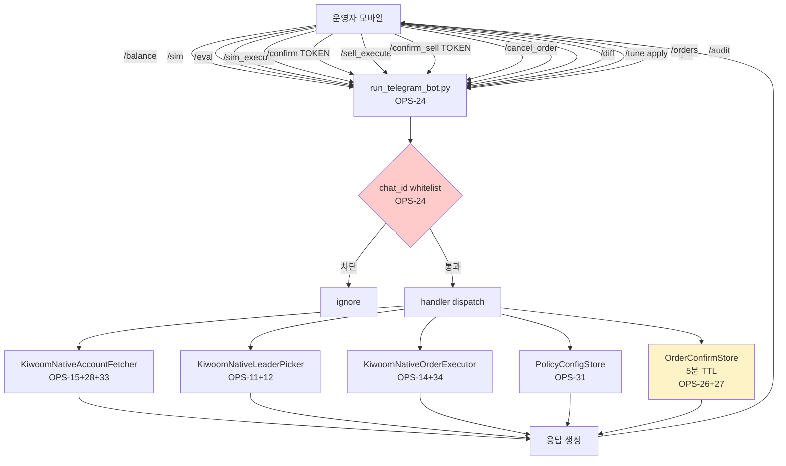
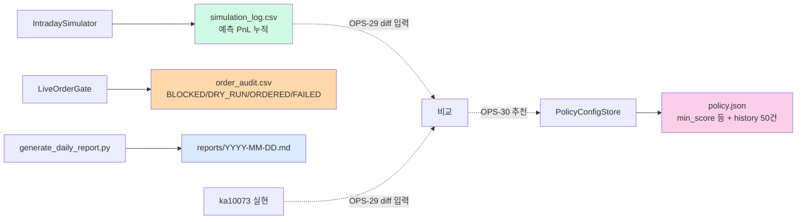
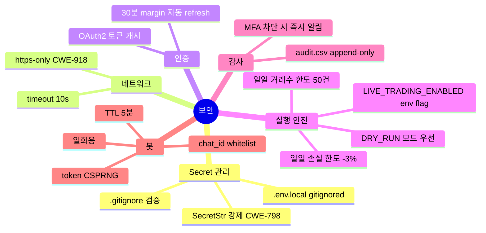

# BarroAiTrade 시스템 흐름도

> 26 OPS BAR 누적된 운영 자동화 시스템 전체 흐름.
> [[ops-track-index|작업 순서 인덱스]]

---

## 1. 매수 사이클 (09:30 cron)



---

## 2. 매도 사이클 (매시간 10~15시)



---

## 3. 미체결 처리 (필요 시)

```mermaid
flowchart LR
    A[지정가 매수] -.미체결.-> O[/orders 명령<br/>kt00004]
    O --> CHK{체결 안 됨?}
    CHK -->|yes| C[/cancel_order ORD_NO SYMBOL<br/>kt10003]
    CHK -->|no| W[대기]
    C --> AU[audit append CANCELED]
    C --> RE[새 가격으로 재진입]
    RE -.사이클 반복.-> A
    
    style O fill:#fef3c7
    style C fill:#fecaca
```

---

## 4. 학습 루프 (주1회)

```mermaid
flowchart TD
    A[1주~1개월 누적] --> B[/diff 명령<br/>OPS-29]
    B --> SIM[simulation_log.csv<br/>예측 PnL]
    B --> REAL[ka10073 실현 PnL<br/>OPS-28]
    SIM --> CMP[compare 매칭]
    REAL --> CMP
    CMP --> BIAS[bias_counts<br/>양호 / 과대 / 과소 / 신호없음]
    BIAS --> TUNE[/tune 명령<br/>OPS-30]
    TUNE -->|과대 ≥50%| R1[min_score +0.1 ⚠️]
    TUNE -->|양호 ≥80%| R2[min_score -0.1 ℹ️]
    TUNE -->|과소 ≥30%| R3[stop_loss +0.5 🚨]
    TUNE -->|양호 ≥80% n≥5| R4[max_per_position +0.05 ℹ️]
    R1 --> APPLY{/tune apply<br/>OPS-31}
    R2 --> APPLY
    R3 --> APPLY
    R4 --> APPLY
    APPLY --> JSON[data/policy.json<br/>+ history 50건]
    JSON -.다음 시뮬 자동 반영.-> NEXT[OPS-32 자동 로드]
    NEXT -.다음 매수 사이클.-> M[매수 사이클]
    
    style BIAS fill:#fef3c7
    style APPLY fill:#dbeafe
    style JSON fill:#d1fae5
```

---

## 5. 텔레그램 양방향 봇 (24/7 데몬)



---

## 6. 7중 보안 layer (매수·매도 confirm 패턴)

```mermaid
flowchart LR
    M[모바일 명령] --> L1[1.chat_id whitelist<br/>OPS-24]
    L1 --> L2[2.6자리 token<br/>secrets CSPRNG<br/>OPS-26]
    L2 --> L3[3.5분 TTL<br/>OPS-26]
    L3 --> L4[4.일회용 폐기<br/>OPS-26]
    L4 --> L5[5.chat_id 매칭<br/>OPS-26]
    L5 --> L6[6.LiveOrderGate 4중<br/>OPS-17]
    L6 --> L7[7.ENV flag<br/>LIVE_TRADING_ENABLED<br/>OPS-17]
    L7 --> EX[KiwoomOrderExecutor]
    EX --> AU[audit.csv]
    
    style L1 fill:#fee2e2
    style L2 fill:#fee2e2
    style L3 fill:#fee2e2
    style L4 fill:#fee2e2
    style L5 fill:#fee2e2
    style L6 fill:#fecaca
    style L7 fill:#fca5a5
```



---

## 7. 데이터 영속 구조



---

## 8. End-to-End 풀 자동화 cron 매핑

```mermaid
gantt
    title 매일 운영 cron 스케줄
    dateFormat HH:mm
    axisFormat %H:%M
    
    section 매수
    시뮬 + 추천 + 실행 + 텔레그램  :09:30, 30m
    
    section 매도 평가
    매시간 TP/SL 평가  :10:00, 6h
    
    section 강제 청산
    장 마감 5분 전 전량  :15:20, 10m
    
    section 리포트
    markdown + 텔레그램  :16:00, 30m
    
    section 학습 (주1회)
    /diff → /tune apply  :crit, 16:30, 30m
```



---

## 9. 보안 layer 누적



---

## 운영 시작 체크리스트

- [ ] 키움 키 회전 (`KIWOOM_APP_KEY` / `KIWOOM_APP_SECRET`)
- [ ] Telegram bot token 회전 (`TELEGRAM_BOT_TOKEN`)
- [ ] `.env.local` 갱신 + `set -a; . ./.env.local; set +a` 검증
- [ ] cron 4건 등록 (매수 09:30 / 평가 매시간 / 청산 15:20 / 리포트 16:00)
- [ ] 봇 데몬 시작 (`nohup ... run_telegram_bot.py &`)
- [ ] 모바일 `/ping` 응답 확인
- [ ] 1~2주 mockapi 검증 → 실전 host 결정

→ 가이드: [[../05-paperclip/runbook-ops]]
→ 보안 가이드: [[../05-paperclip/security-rotation]]
