# 티마(TIMA) 앱 벤치마킹 PRD — 시장 테마 기능 · 매매전략 기능

> **Project**: BarroAiTrade
> **Type**: 참조(벤치마킹/역설계) PRD + BarroAiTrade 구현 매핑
> **Author**: beye (CTO-lead)
> **Date**: 2026-07-02
> **Source**: 화면 녹화 `화면 기록 2026-07-02 19.45.10.mov` (548초, 398×854, 2026-07-02 19:45~19:54 KST 실사용 세션)
> **분석 방법**: 1초 간격 548프레임 추출 → 19개 병렬 에이전트 전수 분석 → 핵심 화면 16장 수동 재검증 → UI/UX 4렌즈(타이포·레이아웃/컴포넌트/UX플로우/접근성) 병렬 분석 + 주요 색상 픽셀 실측
> **디자인 레퍼런스**: 대표 프레임 27장 + 전체 548프레임 컨택트 시트 10장 → [`tima-app-assets/`](tima-app-assets/) (§6.1 갤러리 · §6.1.1 스토리보드)
> **Status**: Draft v1.2

---

## 1. 문서 개요

### 1.1 목적

㈜코리아정보통신의 주식 정보 앱 **"티마"** 를 프레임 단위로 역설계하여, 사용자 요구 2대 핵심 기능인
① **시장 테마 기능**(테마별 종목 그룹핑·테마 보드·종목↔테마 연계)과
② **매매전략 기능**(F존포착/F존+/SF존/골드존/38스윙 + 차트 기준선 + Push 알림)의
화면·데이터·인터랙션 명세를 기록하고, BarroAiTrade 기존 자산과의 갭을 매핑한다.

티마 앱은 BarroAiTrade가 이미 백엔드로 구현한 전략군(F존 BAR-46, SF존 BAR-47, 골드존 BAR-48, 38스윙 BAR-49)의 **원조 참조 앱**이므로, 본 문서는 프론트엔드(대시보드) 기능 격차 해소의 기준 명세 역할을 한다.

### 1.2 표기 원칙

- 프레임 인용: `f_0213` = 녹화 시작 후 약 213초 시점 프레임.
- **관찰**: 영상에서 직접 확인된 사실. **추정**: 화면 단서 기반 해석(명시 표기).
- OCR 한계: 저해상도(398px 폭)로 일부 종목명·수치는 오독 가능. 재검증 프레임 기준으로 정정했으나 잔여 오차 가능성 있음.

---

## 2. 제품 개요 — 티마 앱 정보 구조

### 2.1 글로벌 내비게이션

| 영역 | 구성 | 근거 |
|---|---|---|
| 하단 탭바 (5) | **마켓중심**(홈) · **NXT** · **마켓일정** · **F존** · **시장종합** | f_0001 |
| 상단 공통 셸 | 티마 로고 · 날짜/시각(`07-02(목) 19:44`) · 아이콘 3종(메모/새로고침/캘린더 추정) · 검색바 **"종목, 테마명을 입력하세요"** · 노트 · 햄버거 메뉴 | f_0001 |
| 하단 글로벌 티커 | ① 특징주 뉴스 배너(베이지 배경, `시각 + [특징주]·[미국 특징주]·[인도 특징주] 주황 라벨 + 제목`, 실시간 롤링) ② 지수 바(코스닥/코스피 지수·등락·등락률, 보라 배경) | f_0001, f_0325 |
| 햄버거 메뉴 (9) | 홈페이지 · 이용안내 · 유튜브 / 나의관심 · 알림내역 · 환경설정 · 이용약관 · 개인정보처리방침 / 로그아웃 | f_0240 |

### 2.2 화면 여정 타임라인 (녹화 세션 요약)

| 프레임(≈초) | 시각(KST) | 화면 |
|---|---|---|
| 001–010 | 19:45 | 마켓중심 홈 — 테마 보드 (K뷰티·송배전·건설·로봇) |
| 011–120 | 19:45–48 | SK하이닉스 종목 상세 — 정보 → 차트(B1/B2/B3) → 호가(시간별/일별) |
| 121–180 | 19:48 | 종목 상세 왕복, 뉴스 외부 링크(브라우저 전환), 마켓중심 복귀 |
| 181–216 | 19:48–49 | 마켓중심 → **타임라인 모달** (10:00/12:30/15:35 스냅숏) |
| 241–279 | 19:49 | 햄버거 메뉴 → **알림내역** (전체/F존+/SF존/골드존/38스윙) |
| 280–330 | 19:49–50 | **환경설정** (Push 알림 4종 ON, 어둡게 토글 ON→다크모드→OFF), NXT 탭 |
| 331–360 | 19:50 | **마켓일정** (일/주/월 뷰) |
| 361–420 | 19:51–52 | 원익IPS·SK이터닉스 상세, **F존+ 리스트** |
| 421–510 | 19:52–53 | **SF존 리스트** → 진흥기업·마키나락스 차트(SF/B1/B2/B3, 분봉 전환) → LS ELECTRIC 정보/호가 → **골드존 리스트** → **38스윙 리스트** |
| 511–548 | 19:53–54 | F존포착 리스트, **시장종합** (매매동향·지수·야간선물) |

### 2.3 공통 UI 컬러 시스템 (라이트 모드 관찰)

> 정밀 hex 실측값은 §6.2 컬러 시스템 참조.

| 용도 | 색 | 근거 |
|---|---|---|
| 테마 박스 헤더 | teal(청록) 배경 + 테마명 검정 + 대금 배지 | f_0001 |
| 상승/하락 | 빨강 / 파랑 (가격·등락률·바 차트 공통) | 전 화면 |
| 강조(기준가 박스·더보기·특징주 라벨·일정 뱃지) | 주황 | f_0509 등 |
| 선택 상태(탭·토글) | 분홍 (다크모드에서는 토글 황색) | f_0495, f_0302 |
| 전략 뱃지 | F존+ 청록(FP) · SF존 분홍(SF) · 골드존 황색 · 38스윙 보라(38) | f_0275, 배치10 |
| 활성 서브탭(F존·NXT·타임라인) | 황색 배경 | f_0422, f_0325, f_0213 |

---

## 3. 핵심 기능 1 — 시장 테마 기능

### 3.1 테마 보드 (마켓중심 홈) — `f_0001`

| 테마 보드 홈 | 타임라인 스냅숏 모달 |
|---|---|
| 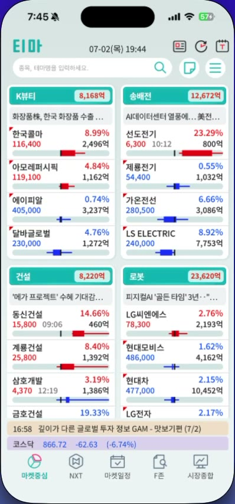 | 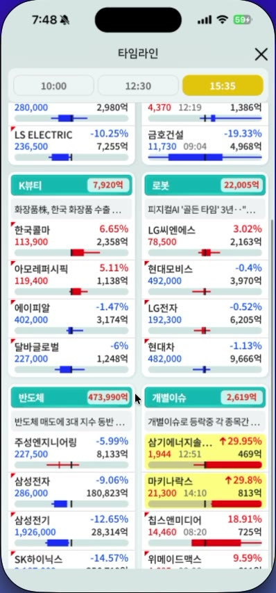 |

**레이아웃**: 2열 그리드의 테마 카드 스크롤 피드.

**테마 카드 구성** (위→아래):
1. **헤더(teal)**: 좌 테마명, 우 **테마 거래대금**(억원 배지). 관찰: K뷰티 8,168억 · 송배전 12,672억 · 건설 8,220억 · 로봇 23,620억 · 반도체 538,348억 · 개별이슈 3,010억 (반도체처럼 대금이 커도 별도 정렬 미확인 — 노출 순서 기준은 **추정**: 당일 테마 강도/등락 기반)
2. **테마 이슈 1줄**: 말줄임 텍스트. 관찰 예: "화장품株, 한국 화장품 수출…"(K뷰티), "AI데이터센터 열풍에… 美전…"(송배전), "'메가 프로젝트' 수혜 기대감…"(건설), "피지컬AI '골든 타임' 3년…"(로봇)
3. **대표 종목 4~5행**: 행당 필드 =
   - 좌상단 빨간 삼각 플래그(일부 종목만 — **추정**: 신고가/급등 마커)
   - 종목명 / **등락률%**(우측, 빨강·파랑)
   - 현재가 / 체결시각(HH:MM, 일부만) / 거래대금(억)
   - **박스플롯형 수평 바**: 당일 가격 범위 내 현재가 위치 시각화(**추정**: 저가~고가 레인지 + 시가·현재가 구간 박스, 상승 빨강/하락 파랑)
   - 정렬: 등락률 상위순(관찰: K뷰티 내 한국콜마 8.99% 최상단)

**개별이슈 카드 특수 규칙** (`f_0213`): 상한가/급등 종목은 행 전체 **노란 하이라이트** + `↑29.95%` 화살표 표기 (예: 삼기에너지솔… 1,944 12:51 469억, 마키나락스 21,300 14:10 813억).

**실시간성**: 연속 프레임에서 가격·대금·등락률 초 단위 갱신 관찰(장마감 후 19시대에도 갱신 — NXT 애프터마켓 데이터 연동 **추정**).

### 3.2 시간대별 테마 스냅숏 — "타임라인" 모달 (`f_0211~0216`)

- 진입: 마켓중심 상단 아이콘(**추정**: 시계 아이콘) → 풀스크린 모달 "타임라인", X로 닫기.
- 상단 시간 버튼 3개: **10:00 / 12:30 / 15:35** (장중 3개 고정 스냅숏 시점, 활성 탭 황색).
- 본문: §3.1과 동일한 테마 카드 그리드 — 단, **해당 시각 기준으로 동결된 스냅숏** (10:00과 15:35의 테마 대금·순위 상이함 관찰: 예 K뷰티 15:35 시점 7,920억).
- 가치: 장중 테마 로테이션(오전 주도주 → 오후 주도주)의 시점별 비교.

### 3.3 종목 ↔ 테마 연계 (종목 상세 · 정보 탭) — `f_0120`, `f_0425`, `f_0495`

| 종목 상세 정보 탭 (LS ELECTRIC) | 종목 상세 정보 탭 (진흥기업) |
|---|---|
| 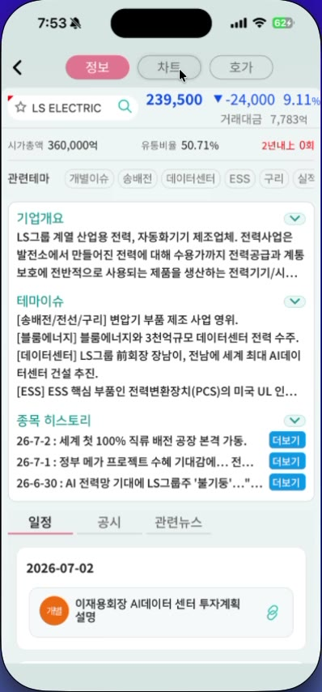 | 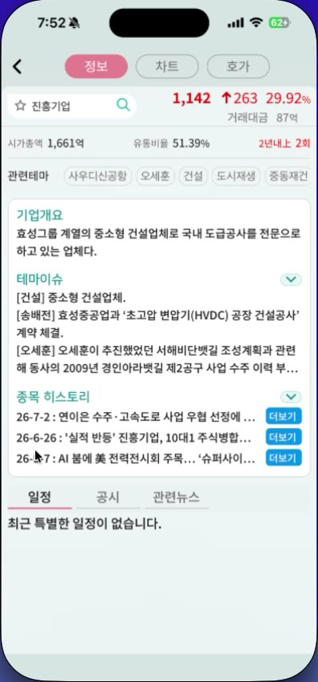 |

**종목 헤더**: ★ 즐겨찾기 토글 + 종목명 검색바 / 현재가 · 등락 · 등락률 / 거래대금. 하위 3탭 **정보 / 차트 / 호가** (활성 분홍).

**정보 탭 구성** (위→아래):
| 섹션 | 내용 | 근거 |
|---|---|---|
| 펀더멘탈 라인 | 시가총액(억) · 유통비율(%) · **"2년내 N회"**(빨강 — **추정**: 최근 2년 상한가 도달 횟수. 진흥기업 "2년내 2회", SK하이닉스·LS ELECTRIC "0회") | f_0425 |
| **관련테마 칩** | 가로 스크롤 칩 리스트. 예: LS ELECTRIC → `개별이슈·송배전·데이터센터·ESS·구리·실적…` / 진흥기업 → `사우디신공항·오세훈·건설·도시재생·중동재건` (**추정**: 칩 탭 시 해당 테마 화면 이동) | f_0495, f_0425 |
| 기업개요 (아코디언) | 1~3문장 기업 설명 | f_0120 |
| **테마이슈** (아코디언) | `[태그] 문장` 반복 형식 — 종목이 각 테마에 묶인 **근거 서술**. 예(LS ELECTRIC): "[송배전/전선/구리] 변압기 부품 제조 사업 영위. [블룸에너지] 블룸에너지와 3천억규모 데이터센터 전력 수주. [데이터센터] …전남에 세계 최대 AI데이터센터 건설 추진. [ESS] ESS 핵심 부품인 전력변환장치(PCS)의 미국 UL 인…" | f_0495 |
| 종목 히스토리 (아코디언) | 날짜별(YY-M-D) 이슈 1줄 + **[더보기]**(파랑) → 원문/외부 브라우저 이동(관찰: MBC뉴스 전환) | f_0495, 배치5 |
| 일정 / 공시 / 관련뉴스 (서브탭) | 일정: 날짜 헤더(YYYY-MM-DD) + 카테고리 원형 뱃지(대통 초록·개별 주황·테마 빨강) + 제목. 빈 상태 문구 "최근 특별한 일정이 없습니다." / 관련뉴스: 날짜 그룹 + 카테고리 색상 칩 | f_0120, f_0425 |

### 3.4 테마·종목 통합 검색 / 나의관심

- 전역 검색바 placeholder가 **"종목, 테마명을 입력하세요"** — 종목과 테마를 단일 입력으로 검색 (f_0001).
- 나의관심: 햄버거 메뉴 항목 + 종목 헤더 ★ 토글로 등록 (배치9 관찰). **종목추가 화면** (`f_0257`): `< 종목추가` 헤더 + 인라인 검색 입력 + 실시간 자동완성 리스트(`000660 SK하이닉스` — 종목코드+종목명 병기) — 타이핑 즉시 후보 노출.
- 언어 설정: 한국어 / English(US) 선택 존재 (배치9 관찰).

### 3.5 뉴스·특징주 티커 & 마켓일정 (테마 문맥 보조)

- **특징주 티커**: 하단 고정 1줄 배너, `HH:MM + [특징주] 주황 라벨 + 헤드라인`. 실시간 교체 관찰(18:30 → 17:42 항목 롤링, f_0541~548). 국가 프리픽스 변형: `[미국 특징주]`, `[인도 특징주]`.
- **마켓일정 탭** (`f_0345`): 날짜 네비(`< 2026.7.2 >`) + **일/주/월** 뷰 토글 + 당일 이벤트 수 배지. 이벤트 카드 = 카테고리 원형 뱃지(**테마** 빨강 / **개별** 주황 / **대통** 초록) + 제목 + 부제 + 링크 아이콘. 관찰 예: "美) 테슬라 2분기 인도량 발표(현지시간)", "코스닥 30주년 기념식(2일차) — 세션주제: K뷰티, 로봇, 바이오, 반도체소부장", "이재용회장 AI데이터 센터 투자계획 설명".
- **월간 캘린더 뷰** (`f_0342`): 요일 그리드 달력 — 날짜 셀마다 이벤트를 **파스텔 칩**(카테고리별 분홍/파랑/보라/노랑 색상)으로 세로 적층, 오늘(2일) 셀은 빨간 라운드 테두리로 강조, 우상단 **"주말" 표시 토글**(초록). 한 달 치 이벤트 밀도를 한 화면에 압축.

| 마켓일정 월간 뷰 |
|---|
| 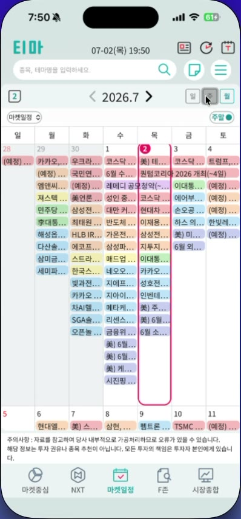 |
- 하단 주의사항 원문: "자료를 참고하여 당사 내부적으로 가공되었으므로 오류가 있을 수 있습니다. 해당 정보는 투자 권유나 종목 추천이 아닙니다. 모든 투자의 책임은 투자자 본인에게 있습니다."

### 3.6 기능 요구사항 (FR-T: 테마)

| ID | 요구사항 | 근거 프레임 | 우선순위 |
|----|---|---|---|
| FR-T-01 | 테마 카드 보드: 2열 그리드, 카드=테마명+테마 거래대금+이슈 1줄+대표종목 4~5행(등락률순) | f_0001 | P0 |
| FR-T-02 | 종목 행: 등락률·현재가·체결시각·거래대금 + 당일 가격범위 박스 바 + 급등 플래그 | f_0001 | P0 |
| FR-T-03 | 급등/상한가 종목 노란 하이라이트 + ↑% 표기 (개별이슈 카드) | f_0213 | P1 |
| FR-T-04 | 시간대별 테마 스냅숏(타임라인): 10:00/12:30/15:35 시점 테마 보드 동결 뷰 | f_0213 | P1 |
| FR-T-05 | 종목 상세: 관련테마 칩(가로 스크롤) + 테마이슈([태그] 근거 서술) 섹션 | f_0495 | P0 |
| FR-T-06 | 종목 히스토리(날짜별 이슈 + 더보기 원문 링크), 일정/공시/관련뉴스 서브탭 | f_0425 | P1 |
| FR-T-07 | 종목+테마 통합 검색, 나의관심(즐겨찾기) | f_0001 | P1 |
| FR-T-08 | 특징주 뉴스 티커(하단 고정, 실시간 롤링) + 지수 바 | f_0541 | P1 |
| FR-T-09 | 마켓일정: 일/주/월 캘린더 + 테마/개별/정책 카테고리 뱃지 | f_0345 | P2 |
| FR-T-10 | 실시간 갱신: 장중 초 단위, 장마감 후 애프터마켓(NXT) 데이터 지속 갱신 | f_0122~131 | P0 |

---

## 4. 핵심 기능 2 — 매매전략 기능 (F존)

### 4.1 전략 서브탭 5종 (F존 탭 상단)

`F존포착 | F존+ | SF존 | 골드존 | 38스윙` — 활성 탭 황색 배경 (f_0422). 각 탭은 **전략별 포착(시그널) 종목 리스트**를 표시하는 스크리너.

### 4.2 전략별 리스트 명세 (관찰 컬럼)

#### F존+ (`f_0480`)
| 컬럼 | 내용 |
|---|---|
| 종목명 + 포착일 | 예: `SK이터닉스 / 07월 01일` (MM월 DD일 형식) |
| 시총(조) | 1.8, 4.6, 36.0 … |
| 현재가 + 등락률 | 파랑 가격 + % |
| 대금(억) | 3,055 … |
| **프로그램** | 프로그램 순매수 수치(**추정**), 양수 빨강 / 음수 파랑 (예: 76,482 / -985,177) |
| **B1 / B2** | 2단 기준가. **주황 박스 = 활성(유효) 기준가 강조**(**추정**: 현재가 근접/미소진 기준가만 박스, 소진·이탈 시 제거) |

#### SF존 (`f_0422`)
| 컬럼 | 내용 |
|---|---|
| 종목명 | 광진실업, 삼기, 진흥기업, 마키나락스 … |
| **상한가** | 상한가 가격 + **도달 시각(HH:MM:SS)** (예: 6,500 / 10:29:55) |
| 현재가 | `↑30.00%` 빨간 배경 배지 병기 — 리스트 전체가 상한가(+29~30%) 종목 |
| 대금(억)/시총(천억) | 2단 |
| **SF** | SF 기준가. 도달 종목은 주황 박스 + 도달 시각 병기 (예: 6,210 / 09:31:11) |
| **B1** | 차순위 기준가 |

→ SF존 = **상한가 직행 종목의 눌림 매수 기준가(SF→B1) 추적** 화면 (**추정**).

#### 골드존 (`f_0509`)
| 컬럼 | 내용 |
|---|---|
| 종목명 + 포착일 | 07월 01일 / 06월 30일 |
| 현재가 + 등락률 | |
| 대금(억)/시총(천억) | |
| **G1 / G2 / G3** | 3단 기준가, 각 셀 하단 **(D+1)/(D+2)/(D+3)** 상대일 표기(**추정**: 포착일 기준 기준가 유효/생성 경과일). 주황 박스 = 활성 기준가 |

관찰 예: LS ELECTRIC → G1 262,500 · G2 254,500 · G3 246,000 (모두 D+1, 현재가 239,500 **위** — 골드존 G계열은 상방 목표/저항 성격 **추정**).

#### 38스윙 (`f_0510`)
| 컬럼 | 내용 |
|---|---|
| 종목명 + 포착일 | 06월 25일~07월 01일 (포착 후 수일 유지 — 스윙 주기) |
| 현재가 + 등락률 / 대금·시총 | |
| **J1 / J2 / J3** | 3단 기준가 + (D+N). 예: 금호건설 11,730 → J1 13,960 · J2 12,940 · J3 12,360 (현재가 **위** — 스윙 목표가 사다리 **추정**) |

#### F존포착 (`f_0512~`, 배치18)
- F존 진입 초기 포착 종목 리스트(**추정**). 컬럼 구조는 F존+와 유사(종목명·현재가·대금·기준가), 세부 컬럼은 저해상도로 일부 미확정.

**전략 리스트 4종 레퍼런스**:

| F존+ | SF존 |
|---|---|
| 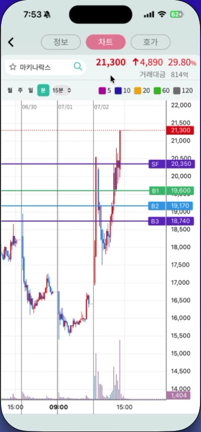 | 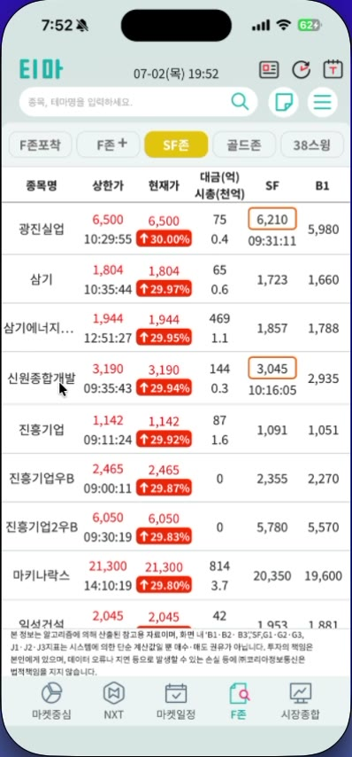 |

| 골드존 | 38스윙 |
|---|---|
| 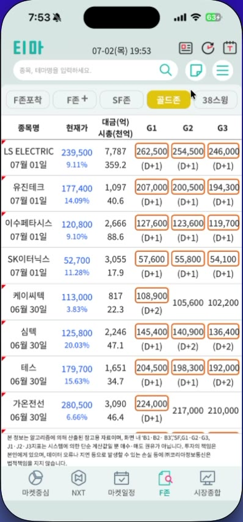 | 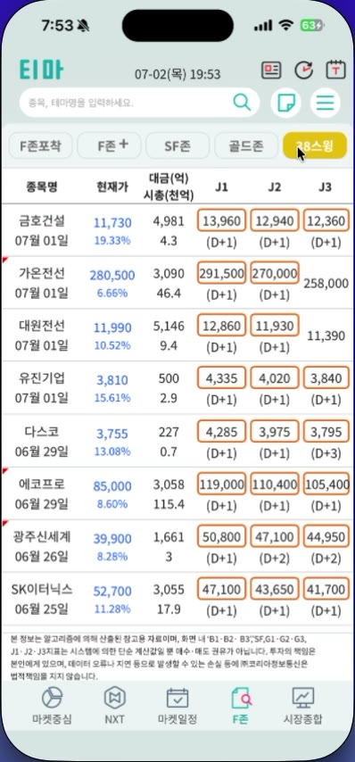 |

### 4.3 차트 매매 기준선 오버레이

| 진흥기업 15분봉 (SF/B1/B2/B3) | 마키나락스 15분봉 (SF/B1/B2/B3) |
|---|---|
| 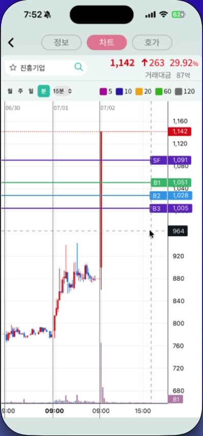 | 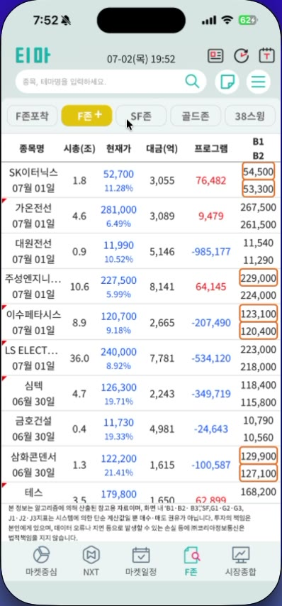 |

종목 차트 위에 전략 기준가를 **수평선 + 우측 컬러 라벨 박스(라벨명+가격)** 로 상시 표시:

| 라벨 | 색 | 관찰 예 (진흥기업 `f_0430`) | 관찰 예 (마키나락스 `f_0420`) |
|---|---|---|---|
| SF | 보라 | 1,091 | 20,350 |
| B1 | 초록 | 1,051 | 19,600 |
| B2 | 파랑 | 1,028 | 19,170 |
| B3 | 진보라 | 1,005 | 18,740 |

- 가격 서열 항상 `SF > B1 > B2 > B3`, 현재가 **아래** 위치 → B계열은 지지/분할매수 기준선(**추정**).
- 골드존 종목 차트(호가 탭 미니차트 포함)에는 **G2(파랑)·G3(빨강)** 라벨 관찰 (LS ELECTRIC `f_0505`), 38스윙 종목 차트에는 **J1/J2/J3**(파랑·파랑·마젠타) 관찰 (배치18) — **종목이 속한 전략에 따라 기준선 세트가 전환됨**.
- 현재가: 빨강(상승)/파랑(하락) 점선 + 우측 현재가 박스. 하단 면책의 지표 명명과 일치: `B1·B2·B3, SF, G1·G2·G3, J1·J2·J3`.

### 4.4 차트 공통 사양 (`f_0060`, `f_0430`, `f_0466~480`)

- **주기 선택**: `월 / 주 / 일 / 분` 토글 + 분 단위 드롭다운 `1·3·5·10·15·30·60분` (체크마크 표시, 15분 기본 관찰). 분봉 전환 시 기준선·이평 범례 유지, X축만 재눈금 (`f_0466` 5분봉 — 레퍼런스 25번).
- **이동평균 5종 + 색 범례**: 5(마젠타) · 10(파랑) · 20(주황) · 60(초록) · 120(회색) — 차트 상단 범례 상시.
- 캔들: 상승 빨강/하락 파랑. 하단 거래량 히스토그램(보라/회색) + 우측 거래량 수치 박스.
- 인터랙션: 터치/드래그 십자선 → 하단 검은 타임박스(HH:MM) + 우측 가격 박스. 주기 전환 시 X축 눈금 자동 전환(분→시각, 일→날짜).
- 데이터 범위: 장마감 후에도 당일 09:00~19:45 데이터 표시(NXT 애프터마켓 포함 **추정**, `f_0516` 19:45 축 확인).

### 4.5 Push 알림 파이프라인

| 알림내역 (SF존 필터) | 환경설정 (라이트) |
|---|---|
| 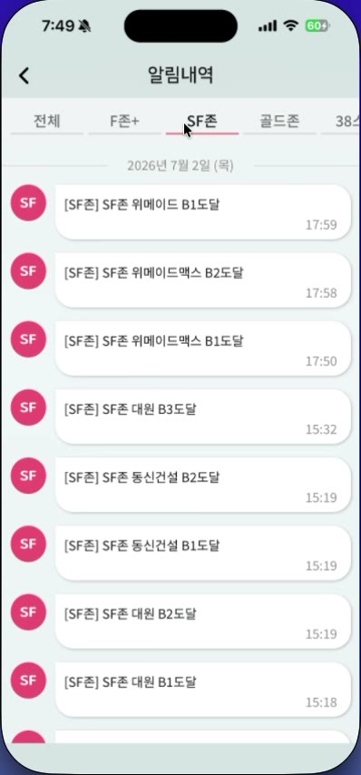 | 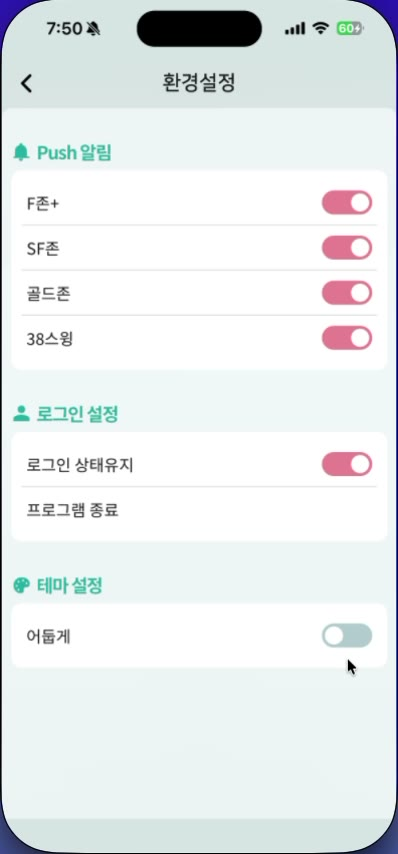 |

**설정** (`f_0300` 라이트 / `f_0302` 다크): 환경설정 > Push 알림 — **F존+ / SF존 / 골드존 / 38스윙** 4개 독립 토글 (녹화 중 사용자가 4종 모두 ON 전환, f_0285→0289).

**알림내역** (`f_0275`): 햄버거 메뉴 > 알림내역.
- 상단 탭: `전체 | F존+ | SF존 | 골드존 | 38스윙` (활성 밑줄 빨강)
- 날짜 그룹 헤더: `2026년 7월 2일 (목)`
- 항목 = 전략 컬러 원형 뱃지(SF 분홍 등) + 메시지 + 발생 시각(HH:MM)
- **메시지 포맷**: `[전략명] 전략명 종목명 {기준선}도달` — 관찰: `[SF존] SF존 위메이드 B1도달 17:59`, `위메이드맥스 B2도달 17:58`, `대원 B3도달 15:32`, `동신건설 B1도달 15:19`
- 이벤트 유형: B1/B2/B3 도달(SF존·F존+), G1~G3 도달(골드존), J1~J3 도달(38스윙) — 배치10 관찰.

### 4.6 종목 호가 탭 (전략 보조 화면, `f_0505`, `f_0093`)

| 호가 + 거래원 창구 (SK하이닉스) | 호가 + G존 미니차트 (LS ELECTRIC) |
|---|---|
| 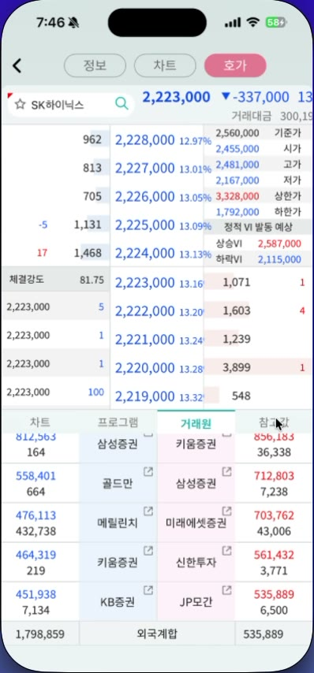 | 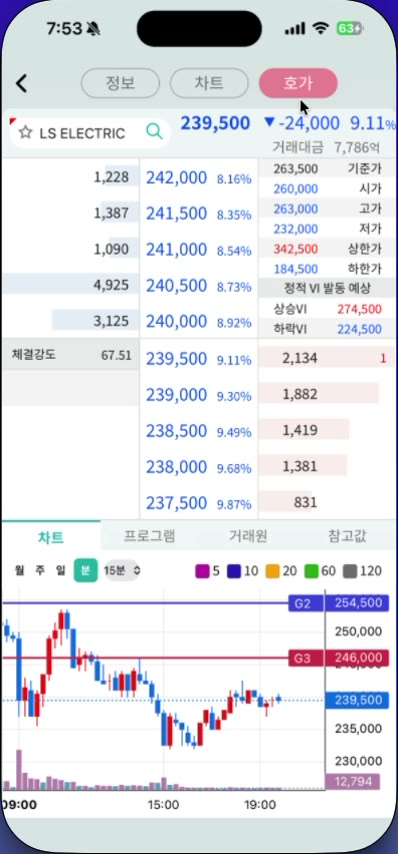 |

- 호가 사다리: 매도/매수 잔량 · 호가 · 등락률. 우측 참조가: 기준가/시가/고가/저가/**상한가(빨강)**/하한가 + **"정적 VI 발동 예상"**(상승VI/하락VI 가격) + **체결강도**(예: 81.75).
- 하단 서브탭: `차트 | 프로그램 | 거래원 | 참고값` — 차트 서브탭에 기준선(G2/G3 등) 포함 미니차트. 체결 내역은 시간별/일별 전환 (f_0072).
- **거래원 서브탭** (`f_0093`): 매도/매수 **상위 5개 증권사 창구** 대칭 배치(관찰: 매도 삼성증권·골드만·메릴린치·키움·KB / 매수 키움·삼성·미래에셋·신한투자·JP모간) + 창구별 수량 + 하단 **외국계합** 매도/매수 합계 — 수급 주체 판단 보조.

### 4.7 면책·컴플라이언스 (원문, `f_0509` 하단)

> "본 정보는 알고리즘에 의해 산출된 참고용 자료이며, 화면 내 'B1·B2·B3', SF, G1·G2·G3, J1·J2·J3 지표는 시스템에 의한 단순 계산값일 뿐 매수·매도 권유가 아닙니다. 투자의 책임은 본인에게 있으며, 데이터 오류나 지연 등으로 발생할 수 있는 손실 등에 ㈜코리아정보통신은 법적책임을 지지 않습니다."

→ 전략 화면·NXT·마켓일정 모두 화면 하단 고정 면책 배치. BarroAiTrade 대시보드도 시그널 화면에 동일 성격의 면책 고정 필요.

### 4.8 기능 요구사항 (FR-S: 매매전략)

| ID | 요구사항 | 근거 프레임 | 우선순위 |
|----|---|---|---|
| FR-S-01 | 전략 스크리너 탭 5종(F존포착/F존+/SF존/골드존/38스윙) — 전략별 포착 종목 리스트 | f_0422 | P0 |
| FR-S-02 | 리스트 공통: 종목명+포착일, 현재가+등락률, 대금/시총, 전략별 기준가 컬럼(B/SF/G/J) | f_0480, f_0509 | P0 |
| FR-S-03 | 기준가 셀 활성 강조(주황 박스) + 도달 시각 표기(SF존) + (D+N) 상대일(골드존·38스윙) | f_0422, f_0509 | P1 |
| FR-S-04 | 차트 기준선 오버레이: 전략별 세트(SF/B1/B2/B3, G1~G3, J1~J3) 수평선+컬러 라벨 박스 | f_0430 | P0 |
| FR-S-05 | 차트: 월/주/일/분(1~60분) 주기, 이평 5/10/20/60/120 범례, 십자선 타임박스 | f_0466~480 | P0 |
| FR-S-06 | Push 알림 설정: 전략별 4종 독립 토글 | f_0300 | P1 |
| FR-S-07 | 알림내역: 전략별 필터 탭 + 날짜 그룹 + `[전략] 종목 {기준선}도달 HH:MM` 이벤트 로그 | f_0275 | P1 |
| FR-S-08 | 프로그램 순매수 컬럼(F존+), 상한가 도달시각(SF존) 등 전략별 특화 컬럼 | f_0480, f_0422 | P2 |
| FR-S-09 | 호가 화면: VI 발동 예상가, 체결강도, 프로그램/거래원 서브탭 | f_0505 | P2 |
| FR-S-10 | 시그널 화면 하단 고정 면책 문구 | f_0509 | P0 |

---

## 5. 보조 기능 (요약)

| 기능 | 관찰 요약 | 근거 |
|---|---|---|
| **NXT 탭** | 애프터마켓(대체거래소) 시세 테이블. 필터 `거래대금/상승률/하락률`(활성 황색). 컬럼: 종목명·시총(천억)·NXT현재가/종가대비%·당일종가/등락률·Aft(억)/누적(억)·일봉 미니맵. 전용 면책 문구 별도 | f_0325 |
| **시장종합 탭** | 투자자별 매매동향(개인/외국인/기관 × 코스피/코스닥/선물, 억원) · 지수 표(코스피/코스닥 등락·거래대금 + 다우/나스닥/선물 %) · 코스피/코스닥 분봉 차트 · 야간선물 | f_0540 |
| **환경설정** | Push 알림 4토글 / 로그인 설정(상태유지 토글, 프로그램 종료) / **테마 설정 — "어둡게" 토글**: 즉시 전앱 다크모드 전환(다크: 짙은 회색 배경+밝은 텍스트+황색 토글, 라이트: 분홍 토글). 본 PRD 범위에선 부록 수준 | f_0300, f_0302 |
| 기타 | 언어 선택(한국어/English), 로그인/로그아웃, 외부 링크(유튜브·홈페이지), 뉴스 원문 브라우저 전환 | 배치9 |

---

## 6. UI/UX 디자인 분석

> 분석 방법: 대표 프레임 22장을 4개 디자인 렌즈(타이포·레이아웃 / 컴포넌트 / UX 플로우 / 접근성·시각위계)로 병렬 분석 + 주요 UI 요소 색상을 Pillow 픽셀 최빈색으로 실측. 색상은 JPEG 압축·양자화로 ±1단계 오차 가능 (8단위 근사). px 수치는 398px 폭 스크린샷 기준 추정치.

### 6.1 디자인 레퍼런스 갤러리

대표 프레임 22장을 [`tima-app-assets/`](tima-app-assets/) 에 편입 (파일명 = 화면 이름). 원본 548프레임 중 화면 유형별 최적 프레임 선별.

| # | 파일 | 화면 | 원 프레임 | 핵심 관찰 포인트 |
|---|---|---|---|---|
| 01 | [theme-board-home](tima-app-assets/01-theme-board-home.jpg) | 마켓중심 테마 보드 | f_0001 | 2열 테마 카드, teal 헤더, 박스플롯 바 |
| 02 | [timeline-snapshot-modal](tima-app-assets/02-timeline-snapshot-modal.jpg) | 타임라인 모달 | f_0213 | 10:00/12:30/15:35 스냅숏, 급등 노란 하이라이트 |
| 03 | [stock-detail-info-skhynix](tima-app-assets/03-stock-detail-info-skhynix.jpg) | 종목 정보(SK하이닉스) | f_0120 | 관련테마 칩, 테마이슈, 일정 서브탭 |
| 04 | [stock-detail-info-lselectric](tima-app-assets/04-stock-detail-info-lselectric.jpg) | 종목 정보(LS ELECTRIC) | f_0495 | 테마이슈 [태그] 서술, 종목 히스토리+더보기 |
| 05 | [stock-detail-info-jinheung](tima-app-assets/05-stock-detail-info-jinheung.jpg) | 종목 정보(진흥기업) | f_0425 | "2년내 2회", 빈 일정 상태 문구 |
| 06 | [chart-b-lines-skhynix](tima-app-assets/06-chart-b-lines-skhynix.jpg) | 차트(B1/B2/B3) | f_0060 | 기준선 라벨 박스, 이평 범례, 주기 토글 |
| 07 | [chart-sf-b-lines-jinheung](tima-app-assets/07-chart-sf-b-lines-jinheung.jpg) | 차트(SF+B, 상한가) | f_0430 | SF>B1>B2>B3 서열, 십자선 타임박스 |
| 08 | [chart-sf-b-lines-makinarocks](tima-app-assets/08-chart-sf-b-lines-makinarocks.jpg) | 차트(SF+B) | f_0420 | 기준선 4종 + 현재가 점선 |
| 09 | [chart-intraday-wonikips](tima-app-assets/09-chart-intraday-wonikips.jpg) | 장중 차트(원익IPS) | f_0360 | 분봉 + B라인, 거래량 히스토그램 |
| 10 | [orderbook-vi-gzone-lselectric](tima-app-assets/10-orderbook-vi-gzone-lselectric.jpg) | 호가+미니차트 | f_0505 | VI 예상가, 체결강도, G2/G3 기준선 |
| 11 | [fzone-plus-list](tima-app-assets/11-fzone-plus-list.jpg) | F존+ 스크리너 | f_0480 | 프로그램 순매수, B1/B2 주황 박스 |
| 12 | [sfzone-list](tima-app-assets/12-sfzone-list.jpg) | SF존 스크리너 | f_0422 | 상한가 도달시각, ↑30.00% 빨간 배지 |
| 13 | [goldzone-list](tima-app-assets/13-goldzone-list.jpg) | 골드존 스크리너 | f_0509 | G1/G2/G3 + (D+N), 면책문구 |
| 14 | [swing38-list](tima-app-assets/14-swing38-list.jpg) | 38스윙 스크리너 | f_0510 | J1/J2/J3 + (D+N) |
| 15 | [alert-history-sfzone](tima-app-assets/15-alert-history-sfzone.jpg) | 알림내역 | f_0275 | 전략 필터 탭, SF 뱃지, "B1도달" 포맷 |
| 16 | [settings-light](tima-app-assets/16-settings-light.jpg) | 환경설정(라이트) | f_0300 | Push 토글 4종, 분홍 토글 |
| 17 | [settings-dark](tima-app-assets/17-settings-dark.jpg) | 환경설정(다크) | f_0302 | 다크 팔레트, 황색 토글 |
| 18 | [market-calendar](tima-app-assets/18-market-calendar.jpg) | 마켓일정 | f_0345 | 일/주/월 토글, 카테고리 뱃지 |
| 19 | [nxt-aftermarket](tima-app-assets/19-nxt-aftermarket.jpg) | NXT 애프터마켓 | f_0325 | 필터 3종, Aft 대금, 일봉 미니맵 |
| 20 | [market-overview](tima-app-assets/20-market-overview.jpg) | 시장종합 | f_0540 | 매매동향 테이블, 지수 차트 |
| 21 | [hamburger-menu](tima-app-assets/21-hamburger-menu.jpg) | 햄버거 메뉴 | f_0240 | 드롭다운 9항목 |
| 22 | [loading-state](tima-app-assets/22-loading-state.jpg) | 로딩 상태 | f_0180 | 중앙 스피너, 셸 유지 |
| 23 | [market-calendar-month](tima-app-assets/23-market-calendar-month.jpg) | 마켓일정 **월간 뷰** | f_0342 | 달력 그리드, 이벤트 파스텔 칩, 오늘 강조 테두리, 주말 토글 |
| 24 | [timeline-surge-highlight](tima-app-assets/24-timeline-surge-highlight.jpg) | 타임라인(급등 강조) | f_0212 | 개별이슈 노란 하이라이트 2건 + ↑29.95% |
| 25 | [chart-5min-makinarocks](tima-app-assets/25-chart-5min-makinarocks.jpg) | 차트 **5분봉** 전환 | f_0466 | 분봉 전환 시 기준선 유지, X축 자동 재눈금 |
| 26 | [orderbook-brokers-skhynix](tima-app-assets/26-orderbook-brokers-skhynix.jpg) | 호가+**거래원 창구** | f_0093 | 매도/매수 상위 증권사 5+5, 외국계합, 체결강도 |
| 27 | [watchlist-add-search](tima-app-assets/27-watchlist-add-search.jpg) | 나의관심 **종목추가 검색** | f_0257 | 인라인 검색 + 자동완성(종목코드+종목명) |

#### 6.1.1 전체 세션 컨택트 시트 — 프레임 단위 스토리보드

548프레임 **전체**를 프레임 번호·시각 라벨付き 컨택트 시트 10장으로 산출 ([`tima-app-assets/contact-sheets/`](tima-app-assets/contact-sheets/), 시트당 60프레임 = 60초, 10열×6행). 화면 전환·데이터 갱신·인터랙션의 초 단위 추적용 — 갤러리(22~27번)에 없는 상태는 여기서 프레임 번호로 역추적 후 원본 영상에서 재추출.

| 시트 | 구간(시각) | 커버 내용 |
|---|---|---|
| [sheet-01](tima-app-assets/contact-sheets/sheet-01-f0001-f0060.jpg) | f_0001–0060 (19:45–46) | 테마 보드 → SK하이닉스 정보 → 차트 진입 |
| [sheet-02](tima-app-assets/contact-sheets/sheet-02-f0061-f0120.jpg) | f_0061–0120 (19:46–47) | 차트 주기 전환 → 호가(시간별/일별/거래원) → 정보 탭 |
| [sheet-03](tima-app-assets/contact-sheets/sheet-03-f0121-f0180.jpg) | f_0121–0180 (19:47–48) | 정보 탭 스크롤, 뉴스 외부 링크, 마켓중심 복귀·로딩 |
| [sheet-04](tima-app-assets/contact-sheets/sheet-04-f0181-f0240.jpg) | f_0181–0240 (19:48–49) | 테마 보드 → **타임라인 모달**(시간탭 전환) → 햄버거 메뉴 |
| [sheet-05](tima-app-assets/contact-sheets/sheet-05-f0241-f0300.jpg) | f_0241–0300 (19:49–50) | 나의관심·종목추가 검색 → **알림내역**(전략 탭 순회) → 환경설정·Push 토글 |
| [sheet-06](tima-app-assets/contact-sheets/sheet-06-f0301-f0360.jpg) | f_0301–0360 (19:50–51) | **다크모드 ON→OFF**(f_0301–0303) → NXT(급등 하이라이트) → 마켓일정 주간/**월간** |
| [sheet-07](tima-app-assets/contact-sheets/sheet-07-f0361-f0420.jpg) | f_0361–0420 (19:51–52) | 원익IPS·SK이터닉스 상세 → F존+ 리스트 → 마키나락스 차트 |
| [sheet-08](tima-app-assets/contact-sheets/sheet-08-f0421-f0480.jpg) | f_0421–0480 (19:52–53) | **SF존 리스트** → 진흥기업 차트 → 분봉 전환(1/3/5/15분) |
| [sheet-09](tima-app-assets/contact-sheets/sheet-09-f0481-f0540.jpg) | f_0481–0540 (19:53–54) | LS ELECTRIC 호가·정보 → **골드존/38스윙/F존포착** → 시장종합 |
| [sheet-10](tima-app-assets/contact-sheets/sheet-10-f0541-f0548.jpg) | f_0541–0548 (19:54) | 시장종합 대기(자동 갱신만 — 티커 롤링·지수 변동) |

### 6.2 컬러 시스템 (픽셀 실측)

**라이트 모드 기본 팔레트**:

| 토큰 | 실측 hex | 용도 | 실측 소스 |
|---|---|---|---|
| `theme-header` | `#10B8A8` (teal) | 테마 카드 헤더, 일/주/월 활성 토글, 섹션 헤더 텍스트 | 01 |
| `bg-app` | `#E0E8E8` | 앱 배경(연한 민트그레이) | 01 |
| `bg-card` | `#F8F8F8`~`#FFFFFF` | 카드/행 배경 | 01 |
| `bg-tabbar` | `#E8F0F0` | 하단 탭바 | 01 |
| `up / danger` | `#C80818`~`#D00010` | 상승·현재가 라벨·긴급 뱃지 (빨강) | 07, 18 |
| `down` | `#3090E0` 계열 | 하락 텍스트·음수 (파랑, 텍스트 코어색은 **추정**) | 07 |
| `accent-active` | `#E0C008` (황색) | 활성 서브탭(F존·NXT·타임라인) | 02 |
| `highlight-surge` | `#F8F880` (노랑) | 급등/상한가 행 하이라이트 | 02 |
| `accent-select` | `#D87090`~`#D83870` (분홍) | 활성 탭(정보/차트/호가), 토글 ON, SF 뱃지 | 15, 16 |
| `emphasis-box` | `#E08040` 계열 (**추정**) | 기준가 주황 강조 박스 테두리 (실측 `#B88060`은 배경 혼합치) | 13 |
| `ticker-news` | `#E8D8C8` (베이지) | 특징주 뉴스 배너 | 01 |
| `ticker-index` | `#D8D0E8` (연보라) | 지수 바 | 01 |

**차트 기준선 팔레트** (07 실측):

| 라벨 | 실측 hex | 색 |
|---|---|---|
| SF | `#5820B8` | 보라 |
| B1 | `#38B068` | 초록 |
| B2 | `#3090E0` | 파랑 |
| B3 | `#5820B8` 계열 | 진보라 (SF와 근접 — 라벨로 구분) |
| G2 / G3 | 파랑 / 빨강 (10 관찰) | 골드존 세트 |
| J1/J2/J3 | 파랑/파랑/마젠타 (배치18 관찰) | 38스윙 세트 |
| 현재가 라벨 | `#C80818` (상승) / 파랑(하락) | 점선 + 우측 박스 |

**다크 모드 팔레트** (17 실측):

| 토큰 | 실측 hex | 비고 |
|---|---|---|
| `bg-app-dark` | `#202020` | 라이트 `#E0E8E8` 대응 |
| `bg-card-dark` | `#383838` | 카드/행 |
| `toggle-on-dark` | `#B8A000` (올리브 황색) | **라이트 분홍 → 다크 황색으로 시맨틱 변경** — 이식 시 일관성 재검토 권장 |
| 섹션 헤더 | `#408878` 근사 (teal 유지) | 브랜드 teal은 모드 불변 |

### 6.3 타이포그래피 & 숫자 표기 규칙

**텍스트 계층** (398px 폭 기준 추정, 렌즈 분석):

| 레벨 | 크기(추정) | 굵기 | 색 | 예 |
|---|---|---|---|---|
| 종목 현재가(상세 헤더) | 15~16px | Bold | 등락색 | `2,224,000` |
| 종목명/카드 헤더 | 13~14px | Bold | 검정 | `SK하이닉스`, `K뷰티` |
| 본문/셀 값 | 12~14px | Regular | 검정/등락색 | 기준가, 대금 |
| 보조 정보(시각·시총·D+N) | 11~12px | Regular | 회색 | `09:06`, `(D+1)` |
| 면책문구 | 9~10px | Regular | 연회색 | 하단 고정 — **대비 부족(§6.7)** |

**숫자 표기 규칙** (전 화면 일관):
- 천단위 콤마 (`Intl.NumberFormat('ko-KR')` 상당), 가격 단위 "원" 생략.
- 대금 축약: **억 / 조 / 천억** 한글 단위 병기 (컬럼 헤더에 `대금(억)/시총(천억)` 식으로 단위 선언 후 셀은 숫자만).
- 등락: 색(빨강/파랑) + `%` + `↑↓` 화살표 또는 `+/-` 부호 **이중 인코딩**.
- 시각: 24시간제 `HH:MM`(알림·뉴스) / `HH:MM:SS`(상한가·SF 도달시각) / 날짜는 화면별 3형식 공존(`YYYY-MM-DD`, `MM월 DD일`, `YY-M-D`) — 이식 시 단일화 권장.
- **숫자 전부 우측 정렬**, 라벨은 좌측 정렬 — 세로 스캔 최적화.

### 6.4 레이아웃 그리드 & 정보 밀도

- **고정(sticky) 셸**: 상단 헤더 ~40-50px(로고·시각·검색) + 하단 탭바 ~50px + 하단 티커 2줄(뉴스+지수). 콘텐츠는 그 사이 스크롤. 종목 상세에서는 종목 헤더+3탭이 준고정.
- **테마 카드**: 2열 각 ~48% 폭, 갭 ~12px, 카드 내부 패딩 좌우 ~12px·상하 ~8-10px, 카드당 높이 ~300px(종목 4~5행 × ~60px).
- **스크리너 테이블**: full-width 단열, 행 높이 ~45-60px, 구분선 1px `#E0E0E0`, 6~7컬럼을 2단 셀(위 큰 값/아래 작은 값)로 압축 — **398px 폭에서 컬럼 수를 늘리는 핵심 패턴**.
- **정보 밀도**: 화면당 15~20 정보 단위. 페이징 대신 **세로 스크롤 + 탭 필터** 선호, 모달은 타임라인 1곳만.
- **모서리 반경 체계**(추정): pill(뱃지·칩) ~12px / 카드 ~8px / 입력·필터 ~6px. 그림자 거의 없는 **flat 디자인** — 경계는 배경색 차이와 1px 구분선으로 표현.

### 6.5 컴포넌트 인벤토리

| 컴포넌트 | 변형/속성 | 레퍼런스 |
|---|---|---|
| 테마 카드 | teal 헤더(테마명+대금 배지) + 이슈 1줄 + 종목행(2단 셀+박스플롯 바) | 01, 02 |
| 박스플롯 바 | 수평 레인지 바 + 박스(상승 빨강/하락 파랑), 행마다 1개 | 01 |
| 뱃지 | ① 전략 원형(SF 분홍 등) ② 카테고리 원형(테마 빨강/개별 주황/대통 초록) ③ 등락 배지(`↑30.00%` 빨간 배경) ④ 대금 배지(헤더 내) | 15, 18, 12 |
| 칩 | 관련테마 칩(아웃라인, 가로 스크롤) | 03, 04 |
| 강조 박스 | 주황 테두리 박스(활성 기준가), `(D+N)` 하단 라벨 | 11, 13, 14 |
| 탭 | ① pill형 3탭(정보/차트/호가, 활성 분홍) ② 서브탭(활성 황색) ③ 밑줄 탭(알림 필터) ④ 토글형(일/주/월, 활성 teal) | 04, 12, 15, 18 |
| 2단 셀 | 위: 큰 값(가격/기준가) / 아래: 작은 값(등락률·시각·D+N) | 11~14 |
| 토글 스위치 | ~48×24px, ON 분홍(라이트)/황색(다크) | 16, 17 |
| 검색바 | 라운드 입력 + 돋보기, placeholder "종목, 테마명을 입력하세요" | 01 |
| 아코디언 | 섹션 헤더(teal 텍스트) + ▼/> 화살표 (기업개요/테마이슈/종목 히스토리) | 04 |
| 모달 | 타임라인 — 반투명 오버레이 + X 닫기 + 시간 탭 | 02 |
| 드롭다운 | 분봉 선택(1~60분, 체크마크) | 07 |
| 차트 라벨 박스 | 기준선 우측 색상 박스(라벨+가격), 현재가 점선 박스 | 06~09 |
| 상태 | 로딩: 중앙 원형 스피너(셸 유지) / 빈 상태: "최근 특별한 일정이 없습니다." | 22, 05 |
| 티커 | 뉴스 1줄 롤링 배너 + 지수 바 (하단 상시) | 01 |

### 6.6 UX 플로우 & 내비게이션 구조

**정보 구조(IA)**: 5탭이 사용자 여정 단계와 1:1 대응 — `마켓중심(테마 발견) → F존(매매 기준 스크리닝) → 종목 상세(검증) → 알림(추적)`, NXT·마켓일정·시장종합은 보조 컨텍스트. 부가 기능(설정·약관·외부 링크)은 햄버거 드로어로 격리해 메인 5탭의 단순성 유지.

**핵심 여정 3개와 클릭 효율** (렌즈 분석):

| 여정 | 경로 | 단계 수 |
|---|---|---|
| 알림 → 검증 | Push 수신 → 알림내역 → 종목 차트(기준선) | **~2클릭 (최단)** |
| 스크리너 → 검증 | F존 탭 → 전략 서브탭 → 종목 → 차트 | ~3클릭 |
| 테마 → 발견 | 마켓중심 → 테마 카드 종목 → 상세 → 차트 | ~4클릭 |

→ **알림 경로가 최단**이 되도록 설계됨 = "시그널 수신 후 즉시 검증" 유스케이스 최우선. BarroAiTrade 대시보드도 알림→차트 딥링크를 P1으로 반영(FR-S-07).

**컨텍스트 유지 패턴**:
- 관련테마 칩 = 종목↔테마 **양방향 내비게이션** 허브 (테마 보드를 거치지 않고 수평 이동).
- 스크리너 리스트가 기준가·도달시각을 **리스트 단계에서 노출** → 상세 진입 전 선별 가능 (미리보기 최적화).
- 내비 깊이 최대 4~5단계로 제한, 모달은 스택 없이 오버레이 처리, 뒤로가기(`<`) 좌상단 고정.
- 실시간 갱신은 수치 텍스트만 교체(레이아웃 리플로우 없음, 배치19 관찰) — 깜빡임 최소화.

### 6.7 접근성 & 강조 위계

**강조 위계 4단계** (강→약): ① 노랑 행 하이라이트(급등/상한가) → ② 주황 박스(활성 기준가) → ③ 빨간 배경 배지(등락 ↑30%) → ④ 컬러 텍스트(일반 등락). 정보의 긴급도와 시각 강도가 비례.

**긍정 관찰**:
- 상승 빨강/하락 파랑(한국 관례)에 `↑↓`·`+/-`·위치(우측정렬)를 **병용한 이중 인코딩** — 색맹 사용자도 방향 인지 가능.
- 본문 대비 양호(라이트: 흰 배경+검정 텍스트 ≈10:1, 다크: `#202020`+밝은 텍스트 ≈9:1).
- 터치 타겟: 하단 탭 ~48px, 리스트 행 45~60px — 적정.

**개선 기회 (BarroAiTrade 이식 시 반영)**:
- 면책문구·범례 9~10px 연회색은 WCAG AA(4.5:1) 미달 우려 → 최소 10px+대비 확보.
- 토글 ON 색상이 모드별 상이(분홍↔황색) → 단일 액센트 유지 권장.
- B3(진보라)와 SF(보라)가 근접색 → 라벨 의존. 이식 시 색 분리 또는 선 스타일(점선) 차별화 권장.
- 기준선 4개+ 동시 오버레이 시 혼잡 → hover/tap 시 해당 선 강조 인터랙션 추가 권장.

### 6.8 BarroAiTrade 이식용 디자인 토큰 제안 (Tailwind)

```js
// tailwind.config.js — tima 벤치마크 기반 (실측 hex, frontend/ 기존 토큰과 병합 필요)
colors: {
  tima: {
    teal:   '#10B8A8',  // 테마 헤더·브랜드 (모드 불변)
    bg:     '#E0E8E8',  // 라이트 배경
    bgDark: '#202020',  // 다크 배경
    card:   '#F8F8F8',
    cardDark:'#383838',
    up:     '#D00010',  // 상승 (한국 관례)
    down:   '#2060C0',  // 하락 (근사)
    active: '#E0C008',  // 활성 서브탭 (황색)
    surge:  '#F8F880',  // 급등 하이라이트
    select: '#D83870',  // 선택 탭·뱃지 (분홍)
    emph:   '#E08040',  // 기준가 강조 박스
  },
  strategyLine: {
    sf: '#5820B8', b1: '#38B068', b2: '#3090E0', b3: '#7B40C8', // B3는 SF와 분리 조정
    g:  '#E0A000', j: '#C81880',  // G/J 세트는 재배색 권장 (원앱 근접색 문제 회피)
  },
}
// 패턴: 2단 셀(위 값/아래 메타), radius: pill 12px·card 8px, flat + 1px divider
// 차트: lightweight-charts createPriceLine({ price, color, title: 'B1', axisLabelVisible: true })
```

---

## 7. BarroAiTrade 매핑 — 갭 분석 & 구현 요구사항

### 7.1 기존 자산 대응표

| 티마 기능 | BarroAiTrade 기존 자산 | 상태 |
|---|---|---|
| F존/SF존/골드존/38스윙 시그널 산출 | `backend/core/strategy/f_zone.py`(BAR-46) · `sf_zone.py`(BAR-47) · `gold_zone.py`(BAR-48) · `swing_38.py`(BAR-49) | ✅ 엔진 보유 |
| 테마 분류·테마별 종목 | ThemeClassifier(BAR-59) · LeaderStockScorer(BAR-60) · REST `GET /api/themes`, `/api/themes/{id}/stocks`(BAR-62a) | ✅ 백엔드 보유 |
| 마켓일정 | EventCalendar(BAR-61) · `GET /api/calendar`(BAR-62a) | ✅ 백엔드 보유 |
| 뉴스·특징주 티커 | 뉴스 수집(BAR-57) · `GET /api/news/recent`(BAR-62a) · news-ticker 컴포넌트(BAR-62b 계획) | ⚠️ 프론트 미구현 |
| NXT 애프터마켓 | NXT Gateway(BAR-53) · 통합호가(BAR-54) | ✅ 백엔드 보유 |
| 실시간 갱신 | WebSocket 파이프라인(BAR-17) · 캐시/WS(BAR-72) | ✅ 보유 |
| 프론트 셸 | Next.js 15 + React 19 + ShadCN + Lightweight Charts(BAR-17), `frontend/app/*` (markets·signals·watchlist·settings 등) | ✅ 보유 |

### 7.2 갭 (티마에 있고 BarroAiTrade 프론트에 없는 것)

1. **테마 보드 UI** — `frontend/app/themes` 라우트 부재(BAR-62b 미착수). 테마 카드(대금·이슈·대표종목·박스 바) 컴포넌트 필요.
2. **시간대별 테마 스냅숏(타임라인)** — 백엔드 스냅숏 저장(10:00/12:30/15:35 등 시점 동결) + 모달 UI. BAR-62a API에 스냅숏 파라미터 없음 → 확장 필요.
3. **전략 스크리너 리스트 뷰** — 전략 엔진 출력(포착 종목 + 기준가 사다리)을 티마식 컬럼 테이블로 노출하는 화면 부재. `app/signals` 확장 후보.
4. **차트 기준선 오버레이** — Lightweight Charts `createPriceLine()`으로 SF/B1/B2/B3·G·J 세트 렌더 (색상 규칙 §4.3).
5. **알림내역 + Push 설정 UI** — 전략별 알림 토글·이벤트 로그 화면. 텔레그램 알림(BAR-49 스케줄러)은 있으나 대시보드 내 알림센터 부재.
6. **종목 상세의 테마 연계 섹션** — 관련테마 칩·테마이슈 근거 서술·종목 히스토리. theme_repo/news_repo 데이터로 구성 가능.

### 7.3 구현 우선순위 권고 (후속 티켓 제안 — 본 PRD 범위 밖)

| 순위 | 항목 | 제안 |
|---|---|---|
| **P0** | 테마 보드 페이지(FR-T-01·02·10) + 전략 스크리너 리스트(FR-S-01·02) + 차트 기준선 오버레이(FR-S-04·05) + 면책(FR-S-10) | BAR-62b 확장 티켓으로 착수 |
| **P1** | 종목 상세 테마 연계(FR-T-05·06) · 알림센터/Push 설정(FR-S-06·07) · 특징주 티커(FR-T-08) · 타임라인 스냅숏(FR-T-04) · 기준가 활성 강조(FR-S-03) | |
| **P2** | 마켓일정 캘린더(FR-T-09) · NXT 뷰 · 시장종합 매매동향 · 호가 보조(FR-S-09) · 다크모드 | |

---

## 8. 부록

### 8.1 OCR 불확실 항목

- 종목명 일부는 저해상도 오독 가능(재검증으로 정정: 위메이드·위메이드맥스·대원·동신건설·진흥기업·마키나락스·가온전선 등). 미재검증 배치의 종목명(예: "삼기", "광진실업")은 원영상 확인 권장.
- 테마 박스 내 "체결시각" 필드(일부 종목만 HH:MM 표시)의 정확한 의미(최근 체결 vs 급등 시각)는 미확정.
- 주황 박스(활성 기준가)와 (D+N)의 정확한 산출 규칙은 화면만으로 확정 불가 — 역설계 시 백테스트로 검증 필요.

### 8.2 다크모드 관찰 노트 (부록 — 사용자 결정에 따라 범위 외)

- 환경설정 > 테마 설정 > "어둡게" 단일 토글. ON 시 환경설정 화면이 즉시 다크 전환(f_0301~0303, 실측 배경 `#202020`·카드 `#383838`): 텍스트 밝음, 섹션 헤더 teal 유지, 토글 강조색 분홍→황색(`#B8A000`).
- **정정(v1.2)**: 녹화에서 다크모드는 f_0301~0303 약 3초만 유지 후 f_0304에서 라이트로 복귀 — 다크 상태로 다른 탭(홈·차트 등)을 탐색한 프레임이 없어 **"전 화면 적용" 여부는 미확인**(설정 화면 적용만 확증). 시스템 설정 연동 여부도 미확인. 컨택트 시트 sheet-06에서 전환 시퀀스 확인 가능.

### 8.3 분석 산출물 위치

- **디자인 레퍼런스 (영구)**: `docs/01-plan/reference/tima-app-assets/` — 대표 프레임 27장 (§6.1 갤러리) + **전체 548프레임 컨택트 시트 10장** (`contact-sheets/`, §6.1.1 — 프레임 번호·시각 라벨付き, 60프레임/장). 리포 커밋 대상, 총 ~4.2MB
- 원본 548프레임(개별 파일): 세션 스크래치패드 `frames_1s/f_0001~0548.jpg` (임시 — 세션 종료 시 소멸 가능. 특정 프레임 고해상 필요 시 원본 영상에서 `ffmpeg -ss <초> -vframes 1` 재추출, 프레임 번호는 컨택트 시트 라벨 참조)
- 배치 분석 JSON: `tasks/wnrbq9ixc.output` (기능 19배치) · `tasks/wn3jk7hew.output` (UI/UX 4렌즈)
- 원본 영상: `/Users/beye/Desktop/화면 기록 2026-07-02 19.45.10.mov`

---

## Version History

| Version | Date | Changes | Author |
|---------|------|---------|--------|
| 1.0 | 2026-07-02 | 548프레임 전수 분석 기반 초판 (테마·매매전략 2대 기능 + BarroAiTrade 매핑) | beye (CTO-lead) |
| 1.1 | 2026-07-03 | §6 UI/UX 디자인 분석 신설(컬러 픽셀 실측·타이포·컴포넌트·UX플로우·접근성·디자인 토큰), 디자인 레퍼런스 이미지 22장 편입(`tima-app-assets/`) 및 본문 임베드, §6→§7·§7→§8 재번호 | beye (CTO-lead) |
| 1.2 | 2026-07-03 | §6.1.1 전체 548프레임 컨택트 시트 10장 신설(프레임 단위 스토리보드), 레퍼런스 5장 추가(23~27: 월간 캘린더·급등 하이라이트·5분봉·거래원 창구·종목추가 검색), §3.4/3.5/4.4/4.6 관찰 보강, §8.2 다크모드 적용 범위 정정 | beye (CTO-lead) |
