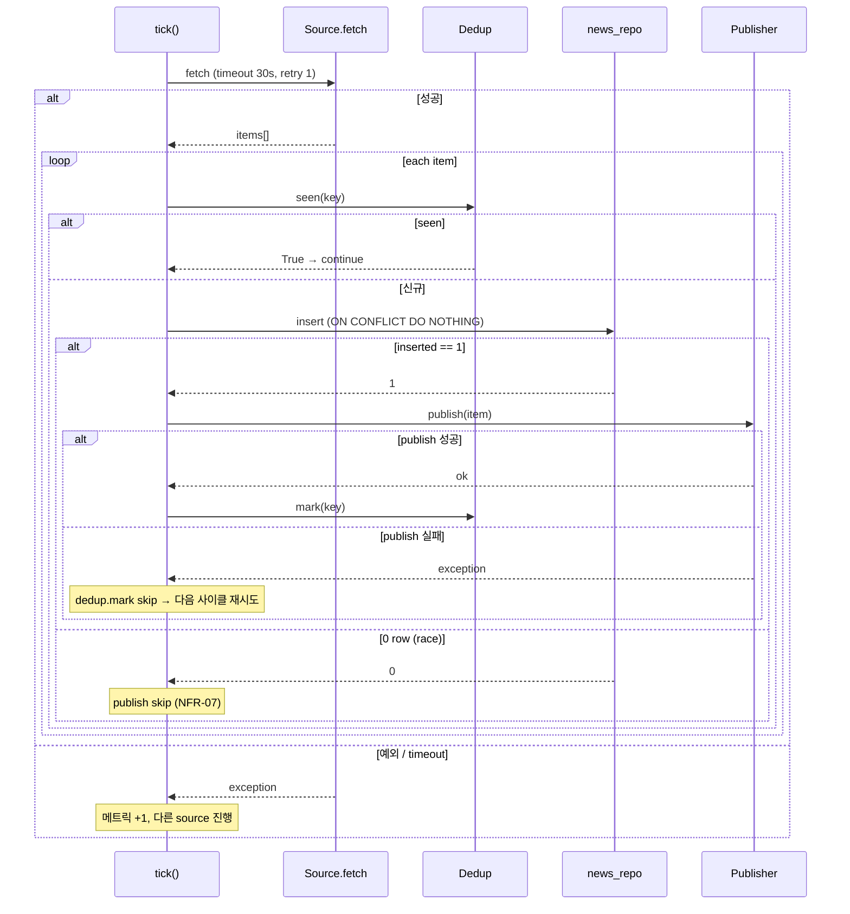

# BAR-57 — 뉴스/공시 수집 파이프라인 Design

**Plan**: `docs/01-plan/features/bar-57-news-collection.plan.md` (PR #88 머지)
**Phase**: 3 (테마 인텔리전스) — 두 번째 BAR / Phase 3 입력 게이트
**Status**: Draft (council: architect + developer + qa + reviewer + security)
**Date**: 2026-05-07
**Worktree**: `/Users/beye/workspace/BarroAiTrade/.claude/worktrees/strange-jackson-3c740a`

> **요약**: BAR-56a (Postgres+pgvector 인프라) 위에서 RSS+DART 1분 polling 수집 파이프라인을 도입한다. 5인 council 권고 (architect/developer/qa/reviewer/security) 를 모두 흡수해 do 진입 시 재논의 0건을 목표로 한다. 본 BAR 는 BAR-57a (worktree 정식 do = 코드 + mock 단위 테스트) 만 다루며, 실 daemon · 24h 운용 검증은 BAR-57b 로 분리.

---

## §0. 분리 정책 (Scope Split)

| BAR | 트랙 | 산출물 | 본 사이클 |
|-----|------|--------|:---:|
| **BAR-57a** | worktree (코드 + mock 단위 테스트) | NewsItem 모델 / Source Protocol (RSS+DART) / Collector orchestrator / Dedup InMemory+Redis / Publisher InMemory+RedisStreams / news_repo / alembic 0002 / Settings 확장 / 의존성 / 보안 시그니처 | ✅ 정식 do |
| **BAR-57b** | 운영 (실 daemon + 실 polling + 24h 운용) | docker compose redis 추가 / 실 DART API 키 / 실 RSS 피드 / 1분 polling 가동 / 24h 누락률 측정 / 중복 0건 검증 / 운영 metric (수집량·실패율·latency) / SQLite fallback 제거 | deferred |

**0.3 결정 근거 (council 5인)**

| 역할 | 합의 |
|------|------|
| architect | 모듈 경계 직교 (정보 vs 시장 데이터 라인). frozen 모델 / dialect 분기 / settings 6 슬롯 추가만 남음 |
| developer | 의존성 4종 + retry/timeout 예산 분할 + ON CONFLICT dialect 분기 명세 보강 시 구현 가능 |
| qa | coverage `--cov-fail-under=70`, 매트릭스 30 → ≥ 34, FR-12↔FR-19 모순 해소 후 do 진입 |
| reviewer | 4단 시퀀스 다이어그램 + Redis Streams 5 항목 계약 + 타입 매핑 표 + InMemory 한계 settings 노출 |
| security | SSRF allowlist + DART query 마스킹 + redis_url SecretStr 승격 + source_id max_length |

**0.4 plan FR-12 ↔ FR-19 모순 해소 (reviewer [차단] 흡수)**

- 채택 정책: **ON CONFLICT DO NOTHING + insert affected_rows == 1 일 때만 publish**
- 폐기 정책: "TTL 만료 후 재게재 시 fetched_at 갱신 후 publish" (FR-12 의 재게재 절)
- 정합 NFR: NFR-07 (재게재 0건) ↔ FR-19 (0 row publish skip) 일치

**0.5 PR 분할 정책**: BAR-57a 도 BAR-56 패턴 답습 — 5단(plan/design/do/analyze/report) PR 분리.

---

## §1. 데이터 모델 (`backend/models/news.py`)

```python
"""
BAR-57 — News data models (Pydantic v2 frozen).
자금흐름 X → Decimal 정책 N/A. tags 는 frozen 호환을 위해 tuple 사용.
"""
from __future__ import annotations

from datetime import datetime
from enum import Enum
from typing import Annotated, Optional

from pydantic import BaseModel, ConfigDict, Field, StringConstraints


class NewsSource(str, Enum):
    """뉴스 출처 — RSS 도메인 또는 DART."""

    DART = "dart"
    RSS_HANKYUNG = "rss_hankyung"
    RSS_MAEKYUNG = "rss_maekyung"
    RSS_YONHAP = "rss_yonhap"
    RSS_EDAILY = "rss_edaily"


# security 권고 — source_id 길이/문자 제약 (CWE-1284, 메모리 폭주 방지)
SourceIdStr = Annotated[
    str,
    StringConstraints(max_length=256, pattern=r"^[\w\-/.]+$"),
]


class NewsItem(BaseModel):
    """수집된 뉴스/공시 1건. frozen — 외부 변조 차단."""

    model_config = ConfigDict(frozen=True, extra="forbid")

    source: NewsSource
    source_id: SourceIdStr             # rcept_no(DART) / guid(RSS)
    title: str = Field(min_length=1, max_length=512)
    body: str = Field(default="", max_length=20_000)
    url: str = Field(min_length=1)     # https only — RSSSource validator 보강
    published_at: datetime              # TZ-aware (UTC)
    fetched_at: datetime                # TZ-aware (UTC)
    tags: tuple[str, ...] = ()          # frozen 호환 (list 불가)
```

### 1.1 9 필드 타입 매핑 표

| 필드 | Pydantic v2 | Postgres (alembic 0002) | SQLite fallback |
|------|-------------|-------------------------|-----------------|
| `source` | `NewsSource` enum | `TEXT NOT NULL` | `TEXT NOT NULL` |
| `source_id` | `SourceIdStr` (max 256) | `TEXT NOT NULL` | `TEXT NOT NULL` |
| `title` | `str` (1~512) | `TEXT NOT NULL` | `TEXT NOT NULL` |
| `body` | `str` (≤ 20K) | `TEXT NOT NULL DEFAULT ''` | `TEXT NOT NULL DEFAULT ''` |
| `url` | `str` (https only) | `TEXT NOT NULL` | `TEXT NOT NULL` |
| `published_at` | `datetime` (UTC) | `TIMESTAMPTZ NOT NULL` | `TEXT` (ISO 8601) |
| `fetched_at` | `datetime` (UTC) | `TIMESTAMPTZ NOT NULL` | `TEXT` (ISO 8601) |
| `tags` | `tuple[str,...]` | `JSONB NOT NULL DEFAULT '[]'::jsonb` | `TEXT NOT NULL DEFAULT '[]'` (JSON) |
| (PK) | (auto) | `BIGSERIAL PRIMARY KEY` | `INTEGER PRIMARY KEY AUTOINCREMENT` |

`UNIQUE (source, source_id)` 제약 추가.

---

## §2. Source 추상 (`backend/core/news/sources.py`)

```python
from typing import Protocol, runtime_checkable

from backend.models.news import NewsItem, NewsSource


@runtime_checkable
class NewsSourceAdapter(Protocol):
    """단일 source 의 fetch 인터페이스. mock 친화."""

    name: NewsSource

    async def fetch(self) -> list[NewsItem]:
        """현재 시점의 가장 최근 N건 반환 (보통 ≤ 50).

        실패 시 예외 raise — 격리·timeout 은 Collector 가 책임.
        """
        ...
```

### 2.1 `RSSSource` (security 권고 흡수)

```python
class RSSSource:
    """
    하드코딩된 RSS host allowlist (SSRF CWE-918 차단):
        hankyung.com / mk.co.kr / yna.co.kr / edaily.co.kr
    Pydantic settings 의 rss_feed_urls 도 동일 allowlist 검증 (validator 추가).
    """

    HOST_ALLOWLIST: frozenset[str] = frozenset({
        "rss.hankyung.com",
        "rss.mk.co.kr",
        "www.yna.co.kr",
        "rss.edaily.co.kr",
    })

    name: NewsSource
    feed_url: str          # https only
    http: httpx.AsyncClient

    def __init__(self, name, feed_url, http):
        if not feed_url.startswith("https://"):
            raise ValueError(f"non-https feed_url blocked: {feed_url}")
        host = urlparse(feed_url).hostname or ""
        if host not in self.HOST_ALLOWLIST:
            raise ValueError(f"host not in allowlist: {host}")
        ...
```

### 2.2 `DARTSource` (security 권고 흡수)

```python
class DARTSource:
    """
    OpenDART API. crtfc_key 는 SecretStr 로 주입 + httpx params dict 분리 (CWE-532).
    URL 쿼리스트링 평문 노출 금지. 로그에서 query 마스킹.
    """

    name = NewsSource.DART
    base_url = "https://opendart.fss.or.kr/api/list.json"

    def __init__(self, api_key: SecretStr, http: httpx.AsyncClient):
        self._api_key = api_key
        self._http = http

    async def fetch(self) -> list[NewsItem]:
        # params dict — get_secret_value() 는 호출 시점에만
        resp = await self._http.get(
            self.base_url,
            params={"crtfc_key": self._api_key.get_secret_value(), "page_count": 50},
        )
        # 예외 로그에서 url.query 마스킹: ?crtfc_key=*** 로 치환
        ...
```

---

## §3. Dedup (`backend/core/news/dedup.py`)

```python
from typing import Protocol


class Deduplicator(Protocol):
    async def seen(self, key: str) -> bool: ...
    async def mark(self, key: str) -> None: ...


class InMemoryDeduplicator:
    """
    LRU + TTL 만료. settings.NEWS_DEDUP_TTL_HOURS=24 사용.
    queue maxsize = settings.NEWS_INMEMORY_QUEUE_MAX (기본 10000).
    """

    def __init__(self, ttl_hours: int = 24, max_size: int = 10_000): ...


class RedisDeduplicator:
    """
    Redis SET key + EXPIRE. TTL = 72h (settings.NEWS_DEDUP_TTL_HOURS_REDIS=72).
    redis_url: SecretStr (security 권고 — CWE-522 평문 보관 차단).
    """

    def __init__(self, redis_url: SecretStr, ttl_hours: int = 72): ...
```

**dedup key 포맷**: `f"news:dedup:{news_item.source.value}:{news_item.source_id}"`

---

## §4. Publisher (`backend/core/news/publisher.py`)

```python
class StreamPublisher(Protocol):
    async def publish(self, item: NewsItem) -> None: ...


class InMemoryStreamPublisher:
    """asyncio.Queue, maxsize = settings.NEWS_INMEMORY_QUEUE_MAX (기본 10000).
    full 시 drop + 메트릭 +1 (block 안 함, FastAPI lifespan 차단 회피)."""


class RedisStreamPublisher:
    """Redis Streams XADD news_items MAXLEN ~10000."""

    def __init__(self, redis_url: SecretStr): ...
```

### 4.1 Redis Streams 5 항목 계약 (reviewer 권고)

| 항목 | 값 |
|------|------|
| stream key | `news_items` |
| consumer group | `embedder_v1` (BAR-58 진입 시점 등록) |
| XADD field schema | 단일 필드 `payload` = `NewsItem.model_dump_json()` (UTF-8) |
| ACK / PEL 정책 | BAR-58 consumer 가 처리 성공 시 XACK; 실패 PEL 1h 누적 시 alert |
| MAXLEN 근거 | RSS 5 source × 분당 0.5건 + DART 분당 1건 ≈ 분당 4건. 10000 / 4 ≈ **41시간** retention |

---

## §5. Collector (`backend/core/news/collector.py`)

```python
class NewsCollector:
    def __init__(
        self,
        sources: list[NewsSourceAdapter],
        repo: NewsRepository,
        publisher: StreamPublisher,
        dedup: Deduplicator,
        http_client: httpx.AsyncClient,    # 단일 client 공유
        scheduler: AsyncIOScheduler,
    ): ...

    def start(self) -> None:
        """orchestrator 가 부팅 시 호출. apscheduler 1분 cron job 등록."""

    async def stop(self) -> None:
        """scheduler shutdown + http_client aclose."""

    async def tick(self) -> None:
        """
        1분 trigger. 모든 source 를 격리 실행 (asyncio.gather + return_exceptions=True).
        """
        results = await asyncio.gather(
            *[self._fetch_one(s) for s in self._sources],
            return_exceptions=True,
        )
        # 예외는 메트릭 +1, 다른 source 진행 차단 X

    async def _fetch_one(self, src: NewsSourceAdapter) -> None:
        """단일 source — 30s 예산 분할 + 1회 retry + 4단 시퀀스."""
        try:
            items = await asyncio.wait_for(self._fetch_with_retry(src), timeout=30)
        except (asyncio.TimeoutError, Exception) as e:
            logger.warning("source %s failed: %s", src.name, e)
            return

        for item in items:
            key = f"news:dedup:{item.source.value}:{item.source_id}"
            if await self._dedup.seen(key):
                continue
            inserted = await self._repo.insert(item)   # ON CONFLICT DO NOTHING — 0 or 1
            if inserted:
                await self._publisher.publish(item)
                await self._dedup.mark(key)
            else:
                # 0 row = 다른 worker 가 이미 처리. publish skip (NFR-07 재게재 0건)
                pass
```

### 5.1 retry + timeout 예산 분할 (developer 권고)

- `httpx.Timeout(connect=5, read=10, write=5, pool=5)` (httpx 레벨)
- `_fetch_with_retry`: 1회 실패 → 백오프 1s → 2차 시도 (총 ≤ 21s, wait_for 30s 안에 안전 수용)
- 시나리오 분리:
  - "1차 실패→2차 성공" — items 반환
  - "1차 실패→2차 timeout" — wait_for 가 cancel, 메트릭 +1
  - "1차 200ms 성공" — items 반환

### 5.2 4단 호출 시퀀스 + 실패 분기



---

## §6. Repository (`backend/db/repositories/news_repo.py`)

`audit_repo` 패턴 답습 — `text()` + named param + dialect 분기.

```python
import json
from datetime import datetime

from sqlalchemy import text

from backend.db.database import get_db
from backend.models.news import NewsItem


class NewsRepository:
    async def insert(self, item: NewsItem) -> bool:
        """ON CONFLICT DO NOTHING. inserted == 1 이면 True (publish 트리거)."""
        async with get_db() as db:
            if db is None:
                return False

            tags_payload: object
            if db.engine.dialect.name == "sqlite":
                tags_payload = json.dumps(list(item.tags), ensure_ascii=False)
                sql = text("""
                    INSERT OR IGNORE INTO news_items
                        (source, source_id, title, body, url, published_at, fetched_at, tags)
                    VALUES (:source, :source_id, :title, :body, :url,
                            :published_at, :fetched_at, :tags)
                """)
            else:
                tags_payload = list(item.tags)
                sql = text("""
                    INSERT INTO news_items
                        (source, source_id, title, body, url, published_at, fetched_at, tags)
                    VALUES (:source, :source_id, :title, :body, :url,
                            :published_at, :fetched_at, :tags)
                    ON CONFLICT (source, source_id) DO NOTHING
                """)

            result = await db.execute(sql, {
                "source": item.source.value,
                "source_id": item.source_id,
                "title": item.title,
                "body": item.body,
                "url": item.url,
                "published_at": item.published_at,
                "fetched_at": item.fetched_at,
                "tags": tags_payload,
            })
            return (result.rowcount or 0) == 1

    async def find_recent_by_source(
        self, source: NewsSource, limit: int = 100,
    ) -> list[dict]: ...
```

---

## §7. Alembic 0002 (`alembic/versions/0002_news_items.py`)

```python
"""news_items table — BAR-57.

Revision ID: 0002
Revises: 0001
Create Date: 2026-05-07
"""
from __future__ import annotations

import sqlalchemy as sa
from alembic import op
from sqlalchemy.dialects import postgresql

revision = "0002"
down_revision = "0001"
branch_labels = None
depends_on = None


def upgrade() -> None:
    # JSONB (Postgres) — SQLite fallback 시 sa.JSON 가 TEXT 로 매핑됨
    bind = op.get_bind()
    is_pg = bind.dialect.name == "postgresql"
    tags_type = postgresql.JSONB if is_pg else sa.JSON
    ts_type = postgresql.TIMESTAMP(timezone=True) if is_pg else sa.Text

    op.create_table(
        "news_items",
        sa.Column("id", sa.BigInteger, primary_key=True, autoincrement=True),
        sa.Column("source", sa.Text, nullable=False),
        sa.Column("source_id", sa.Text, nullable=False),
        sa.Column("title", sa.Text, nullable=False),
        sa.Column("body", sa.Text, nullable=False, server_default=""),
        sa.Column("url", sa.Text, nullable=False),
        sa.Column("published_at", ts_type, nullable=False),
        sa.Column("fetched_at", ts_type, nullable=False),
        sa.Column(
            "tags",
            tags_type,
            nullable=False,
            server_default=sa.text("'[]'::jsonb") if is_pg else sa.text("'[]'"),
        ),
        sa.UniqueConstraint("source", "source_id", name="uq_news_items_source_id"),
    )
    op.create_index("idx_news_items_source", "news_items", ["source"])
    op.create_index("idx_news_items_published_at", "news_items", ["published_at"])


def downgrade() -> None:
    op.drop_index("idx_news_items_published_at", table_name="news_items")
    op.drop_index("idx_news_items_source", table_name="news_items")
    op.drop_table("news_items")
```

---

## §8. Settings 확장 (`backend/config/settings.py`)

기존 `redis_url`, `dart_api_key`, `rss_feed_urls`, `news_polling_interval_sec` 슬롯에 6개 추가:

```python
# === 뉴스/공시 (BAR-57) ===
news_dedup_backend: Literal["memory", "redis"] = "memory"
news_stream_backend: Literal["memory", "redis"] = "memory"
news_dedup_ttl_hours: int = 24                 # InMemory
news_dedup_ttl_hours_redis: int = 72           # Redis
news_inmemory_queue_max: int = 10_000
news_fetch_timeout_seconds: int = 30
# redis_url 은 SecretStr 승격 — security 권고 (CWE-522)
redis_url: Optional[SecretStr] = None
```

---

## §9. 의존성 (`backend/requirements.txt` 갱신, developer 권고)

```
apscheduler>=3.10           # AsyncIOScheduler
feedparser>=6.0             # RSS XML
redis>=5.0                  # asyncio + streams
lxml>=5.0                   # feedparser fallback
```

`pip install -e .` smoke 검증을 do 단계 첫 commit 게이트.

---

## §10. 테스트 매트릭스 ≥ 34 cases (qa 권고 흡수)

| 그룹 | 케이스 | 위치 |
|------|:------:|------|
| `test_news_models.py` | 5 (frozen / SourceIdStr 길이 / SourceIdStr 패턴 / tags tuple round-trip / TZ-aware enforce) | `backend/tests/news/` |
| `test_rss_source.py` | 5 (https-only / host allowlist / parser fail-soft / source_id from guid / multi-namespace) | 동상 |
| `test_dart_source.py` | 5 (params dict / SecretStr 마스킹 / 401 fallback / 429 backoff / corp_name 결합) | 동상 |
| `test_dedup.py` | 5 (InMemory mark/seen / TTL 만료 → seen False / Redis mock mark/seen / Redis SecretStr / queue full) | 동상 |
| `test_publisher.py` | 4 (InMemory enqueue / queue full drop / Redis XADD MAXLEN / Redis SecretStr) | 동상 |
| `test_collector.py` | 6 (tick 격리 / retry 1차→2차 성공 / retry 1차→2차 timeout / 4단 시퀀스 통합 / publisher 실패 → mark skip / scheduler 1분 trigger) | 동상 |
| `test_news_repo.py` | 3 (insert 신규 → True / 중복 → False / find_recent_by_source) | `backend/tests/db/` |
| `test_alembic_0002.py` | 3 (revision id / upgrade UNIQUE 제약 mock / downgrade reverse) | 동상 |
| **합계** | **36** | — |

**coverage 게이트**: `pytest --cov=backend.core.news --cov=backend.db.repositories.news_repo --cov-fail-under=70`.
**bench**: `test_rss_source_parse_p95_under_500ms` (parse-only, 50건 fixture, P95 < 0.5s).

---

## §11. 회귀 게이트

- baseline: 262 passed (BAR-56a 머지 후)
- 신규: 36 → **≥ 298 passed** (262 + 36)
- DATABASE_URL 미설정 = SQLite fallback → 262 회귀 보존

---

## §12. 디렉터리

```
backend/
  models/news.py                    (신규)
  core/news/
    __init__.py                     (신규)
    sources.py                      (신규 — Protocol + RSSSource + DARTSource)
    dedup.py                        (신규)
    publisher.py                    (신규)
    collector.py                    (신규)
  db/repositories/news_repo.py      (신규)
  config/settings.py                (확장)
backend/tests/
  news/                             (신규 — 33 cases)
    __init__.py
    test_news_models.py / test_rss_source.py / test_dart_source.py
    test_dedup.py / test_publisher.py / test_collector.py
  db/test_news_repo.py              (신규)
  db/test_alembic_0002.py           (신규)
alembic/versions/0002_news_items.py (신규)
backend/requirements.txt            (갱신)
Makefile                            (test-news 타겟 추가)
```

---

## §13. 보안 요약 (security 권고 흡수)

| 항목 | 시그니처 |
|------|----------|
| SSRF (CWE-918) | RSSSource HOST_ALLOWLIST 4 도메인, https-only enforce, settings.rss_feed_urls validator |
| 비밀 노출 (CWE-532) | DARTSource params dict 분리, 로그 query string 마스킹 (`?crtfc_key=***`) |
| 비밀 보관 (CWE-522) | redis_url: SecretStr 승격 (settings.py) |
| 입력 검증 (CWE-1284) | SourceIdStr max_length=256, regex `^[\w\-/.]+$` |

---

## §14. 후속 BAR

- **BAR-57b** : 운영 정식 do (docker compose redis 추가, 실 DART/RSS 가동, 24h 누락률 측정, SQLite fallback 제거)
- **BAR-58** : 임베딩 인프라 — `embedder_v1` consumer group 등록, NewsItem.body → 1536-dim 벡터 → pgvector 적재
- **BAR-59** : 테마 분류기 — NewsItem.tags 자동 부여
- **BAR-67** : SecretStr 일괄 전환 (DART/Redis/Postgres)

---

## §15. 다음 단계

`/pdca do BAR-57` — 본 design 의 §1~§13 항목을 1:1 구현.

DoD 체크리스트:
- [ ] backend/models/news.py + 5 테스트 (test_news_models.py)
- [ ] backend/core/news/sources.py + 10 테스트 (RSS 5 + DART 5)
- [ ] backend/core/news/dedup.py + 5 테스트
- [ ] backend/core/news/publisher.py + 4 테스트
- [ ] backend/core/news/collector.py + 6 테스트 (4단 시퀀스 + retry/timeout)
- [ ] backend/db/repositories/news_repo.py + 3 테스트
- [ ] alembic/versions/0002_news_items.py + 3 테스트 (mock)
- [ ] backend/config/settings.py 6 신규 필드 + .env.example
- [ ] backend/requirements.txt 4 의존성
- [ ] Makefile `test-news` 타겟
- [ ] 회귀 ≥ 298 passed (0 fail)
- [ ] coverage ≥ 70%

---

## Version History

| Version | Date | Changes | Author |
|---------|------|---------|--------|
| 0.1 | 2026-05-07 | Initial draft (council 5인 종합: architect/developer/qa/reviewer/security) | bkit-cto-lead |
