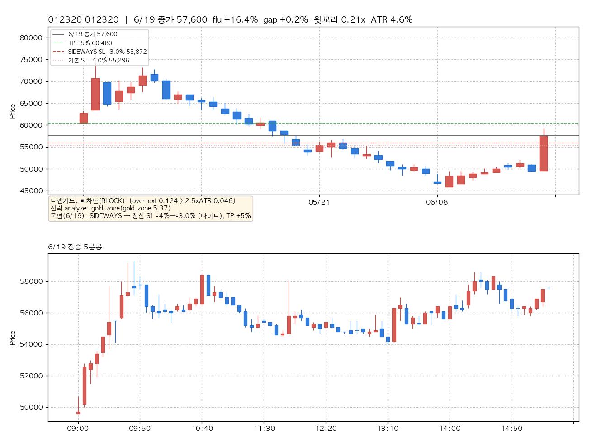
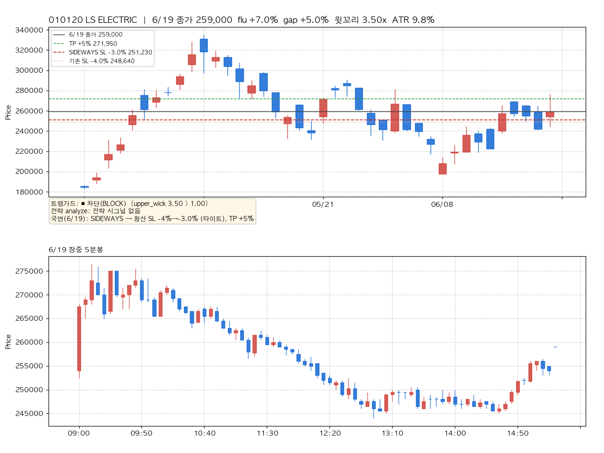
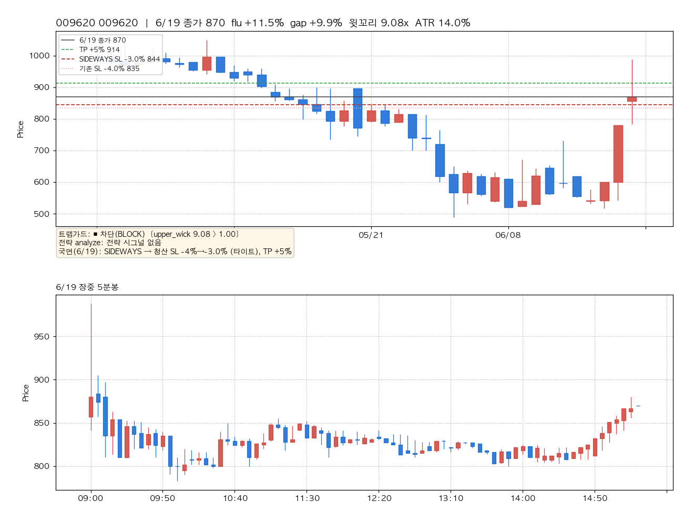
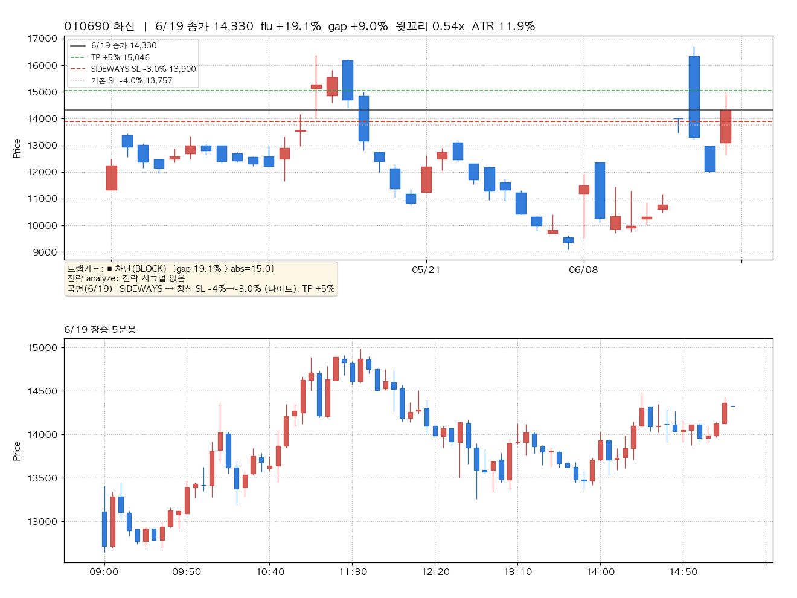
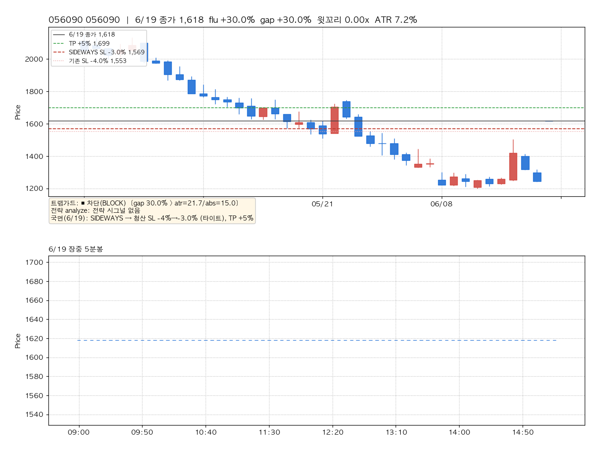
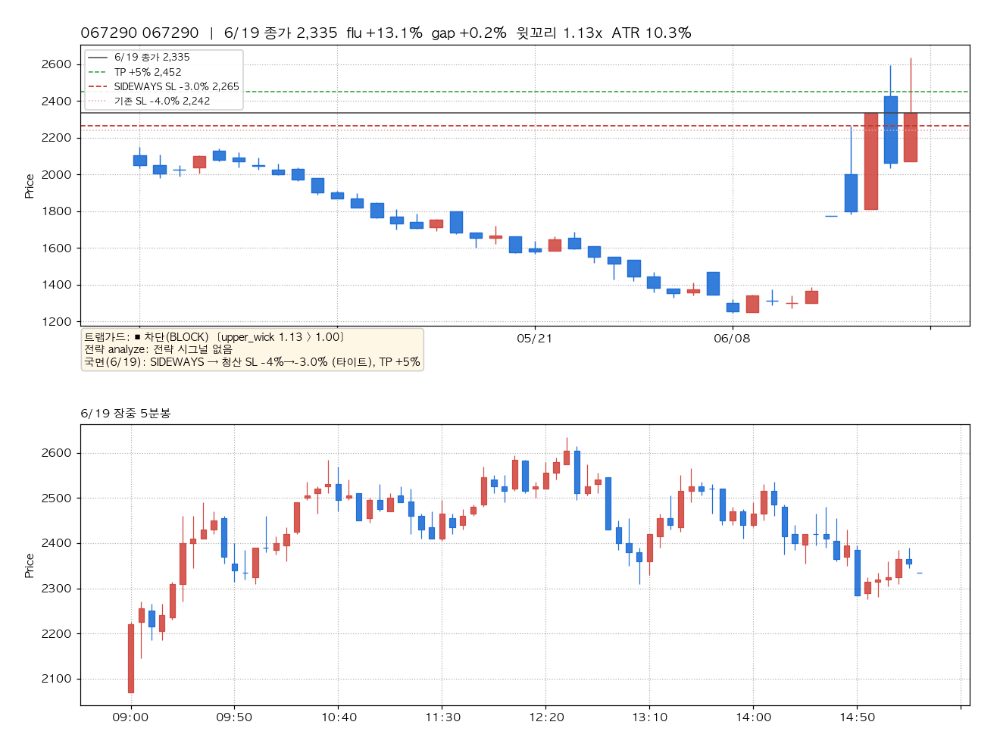
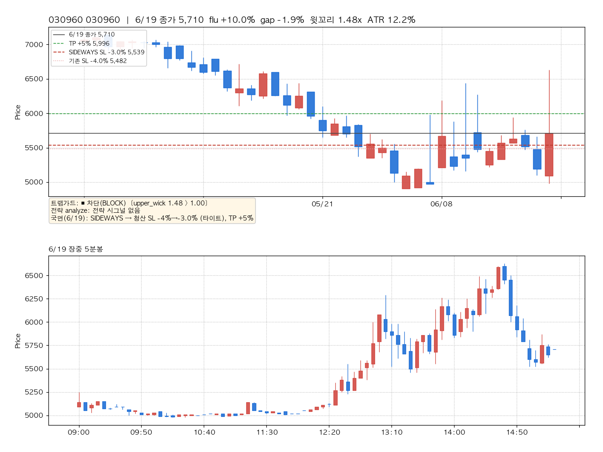
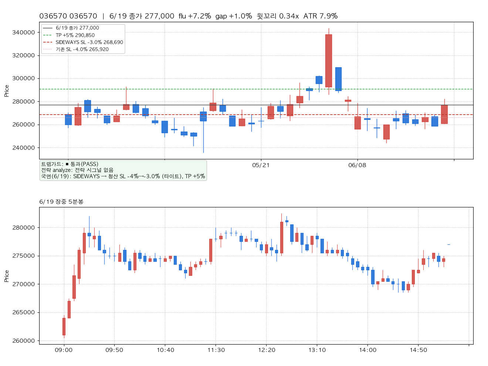

# 6/19 캔들 기준 — 트랩가드(진입) + 국면적응(청산) 로직 시뮬레이션 리포트

> **Project**: BarroAiTrade · **Date**: 2026-06-21 · **대상 거래일**: 2026-06-19 · **Status**: Final (시뮬레이션 — 실거래 무영향)
> **목적**: 신규 구현된 `trap_guard`(진입 가짜돌파 차단) + `regime_exit`(국면 적응 청산) 로직을 **6/19 실측 캔들**에 적용해 "매매시그널 기준"으로 시뮬레이션하고, 종목별 차트로 검증.
> **연관**: [[2026-06-21-tp-sl-exit-logic.report]] · `backend/core/strategy/trap_guard.py` · `backend/core/risk/regime_exit.py`

---

## 0. 요약 — 한 줄 결론

6/19 고갭·장대양봉 무버 **8종목 중 7종목을 트랩가드가 차단**, 정상 셋업(대조군 1종)만 통과. 특히 **gold_zone이 실제 매수 시그널을 낸 종목(012320)을 "과확장 추격"으로 차단** — 6월 반복된 "가짜 상승/개미 꼬시기"를 진입 단계에서 직접 거른다. 청산 측은 6/19 국면(SIDEWAYS)이 **SL −4%→−3%로 타이트화**.

**핵심 발견 3가지:**
1. **윗꼬리 페이드 포착**: 010120·009620 등은 5분봉상 아침 스파이크 후 종일 흘러내림(윗꼬리 3.5x·9.08x) — 트랩가드가 가짜 상승을 그대로 차단.
2. **전략 시그널 위에서 작동**: 012320은 과매도 반등에 gold_zone이 점수 5.37로 진입 신호를 냈지만, 과확장(MA20 +12.4% > 2.5×ATR)으로 트랩가드가 차단.
3. **고갭 OR 설계**: 절대%(15%)와 ATR배수 게이트가 OR로 결합 — 고변동주(화신 ATR 11.9%)는 절대 backstop이, 상한가(056090)는 둘 다 발화.

---

## 1. 시뮬레이션 기준

| 항목 | 내용 |
|------|------|
| **거래일** | 2026-06-19 (KST) |
| **캔들 데이터** | 6/19 **5분봉 = 키움 실측**(09:00~15:30, 캐시 임포트). 일봉 캐시는 6/18까지라 **6/19 일봉은 5분봉에서 합성**(시가=첫봉·고저=장중·종가=종가단일가) |
| **시장 국면** | **SIDEWAYS** (`refined_signals.json` 6/19 실측, 데몬 `classify_regime` 산출) |
| **종목 선정** | 6/19 무버/후보를 캐시에서 재구성. 010120·010690은 실제 6/19 `simulation_log` 후보, 나머지는 등락률 상위 무버. **종목명은 로그에 있는 2종만 표기**(나머지는 코드) |
| **실거래** | 6/19는 `LIVE_TRADING_ENABLED=false`로 **체결 0** — 본 리포트는 순수 시뮬(분석) |
| **트랩가드 임계(예시)** | over_ext k=2.5(baseline MA20)·윗꼬리 max 1.0·gap ATR×3 / 절대 15%·ATR n=14 |
| **국면적응(예시)** | SIDEWAYS SL×0.75 (−4%→−3%), TP×1.0 — f_zone 프로파일 기준 |

> ⚠️ **임계는 예시값**이다. 코드는 **default-OFF로 출하**되며(라이브 byte-identical), 본 시뮬은 "활성화 시 무엇을 할지"를 보여준다. 실제 활성화는 측정 후 (d) HITL.

---

## 2. 결과 (8종목)

| 종목 | flu | gap | 윗꼬리 | ATR% | 트랩가드 | 차단 사유 | 전략 시그널 |
|------|-----|-----|--------|------|----------|-----------|------------|
| **012320** | +16.4% | +0.2% | 0.21x | 4.6% | 🚫 차단 | over_ext 0.124 > 2.5×ATR 0.046 | **gold_zone (5.37)** |
| 010120 LS ELECTRIC | +7.0% | +5.0% | 3.50x | 9.8% | 🚫 차단 | upper_wick 3.50 > 1.00 | - |
| 009620 | +11.5% | +9.9% | **9.08x** | 14.0% | 🚫 차단 | upper_wick 9.08 > 1.00 | - |
| 010690 화신 | +19.1% | +9.0% | 0.54x | 11.9% | 🚫 차단 | gap 19.1% > abs=15.0 | - |
| 056090 | +30.0% | +30.0% | 0.00x | 7.2% | 🚫 차단 | gap 30.0% > atr=21.7/abs=15.0 | - |
| 067290 | +13.1% | +0.2% | 1.13x | 10.3% | 🚫 차단 | upper_wick 1.13 > 1.00 | - |
| 030960 | +10.0% | −1.9% | 1.48x | 12.2% | 🚫 차단 | upper_wick 1.48 > 1.00 | - |
| **036570** | +7.2% | +1.0% | 0.34x | 7.9% | ✅ **통과** | ok (정상 셋업) | - |

**차단율 7/8.** 차단 룰 분포: 윗꼬리 5 · 고갭 2 · 과확장 1. 통과 1(대조군).

---

## 3. 종목별 차트

> 각 차트: **상단=일봉**(최근 40거래일, 6/19 합성봉 포함) + 청산 라인(검정=6/19 종가, 초록 점선=TP, 빨강 점선=SIDEWAYS 타이트 SL, 분홍 점선=기존 SL) / **하단=6/19 장중 5분봉**. 좌하단 박스=트랩가드 판정·전략 시그널·국면 청산.

### 3.1 012320 — gold_zone 매수신호를 "과확장"으로 차단 ★결정적

수주간 70k→47k 하락 후 6/19 +16.4% 반등. **gold_zone이 과매도 반등으로 진입 신호(5.37)를 냈으나**, 종가가 MA20 대비 +12.4%(> 2.5×ATR 11.5%)로 과확장 → 추격 진입 차단. "전략은 사려는데 막는" 개미 꼬시기 포착의 교과서 사례.

### 3.2 010120 LS ELECTRIC — 실제 6/19 후보, 윗꼬리 차단

6/19 실제 sim 후보(거래대금 7,141억). 5분봉상 **시가 갭+5% → 아침 276k 스파이크 → 종일 흘러내려 245k까지** = 윗꼬리 3.5x. 가짜 상승의 전형.

### 3.3 009620 — 극단 윗꼬리 9.08x

gap +9.9%로 출발해 +11.5% 마감했으나 몸통 대비 윗꼬리가 9배 — 상단 매도세가 압도. 트랩가드 윗꼬리 룰의 극단 사례.

### 3.4 010690 화신 — 고갭 추격(절대 15% backstop)

전일比 +19.1%, 시초 갭 +9%. ATR게이트(35.7%)는 통과하지만 **절대 15% backstop**이 차단 — 고변동주에서 ATR배수만으론 못 막는 갭을 절대% OR이 봉쇄.

### 3.5 056090 — 상한가 갭 +30%

시초부터 상한가 부근(+30% 갭), ATR게이트(21.7%)·절대(15%) 둘 다 발화. 가장 명백한 고갭 추격 차단.

### 3.6 067290 — 고등락 + 윗꼬리

+13.1% 마감, 윗꼬리 1.13x로 임계 직상 차단.

### 3.7 030960 — 윗꼬리 1.48x

갭 없이(−1.9%) +10% 마감했으나 윗꼬리 1.48x — 갭이 아니어도 캔들 형태로 가짜 돌파 포착(갭가드와 직교).

### 3.8 036570 — 대조군(통과) ★휩쏘 방지 입증

+7.2% 상승이지만 윗꼬리 0.34x·갭 1%·과확장 아님 → **통과**. 트랩가드가 정상 셋업까지 죽이지 않음(휩쏘 양날 방지)을 입증하는 대조군.

---

## 4. 핵심 발견

1. **진입 단계 직접 차단**: 6월 반복 패턴(고갭/장대양봉 유인 후 페이드)을 매수 전에 거른다. 기존 갭가드는 `{gold_zone,f_zone}`·절대 15%만이었는데, 본 로직은 **윗꼬리·과확장·ATR정규화 갭**으로 확장.
2. **전략 시그널 위에서 작동(012320)**: 트랩가드는 전략과 직교 — 전략이 진입을 원해도(gold_zone 5.37) 추격이면 차단. 6월 손실의 다수였던 "과매도 반등 추격"을 봉쇄.
3. **OR 설계의 가치(010690 vs 056090)**: 고변동주는 절대 backstop, 상한가는 ATR+절대 모두 — 단일 임계의 한계를 보완.
4. **선택성(036570)**: 정상 셋업은 통과 → 휩쏘 양날(`f_zone.py:51-54` impulse_max 교훈) 회피.
5. **청산 타이트화**: SIDEWAYS 국면이 모든 종목 SL을 −4%→−3%로 조정(차트 빨강 점선). 변동성장 손실 꼬리 축소 후보.

---

## 5. 한계 · 다음 단계

- **시뮬은 EOD 완성 일봉 기준(post-hoc)**: 본 시뮬의 윗꼬리·과확장·갭은 **6/19 종료된 일봉**의 실현 형태다. 라이브 데몬은 장중(09:30~) **형성 중 일봉 + 실시간 flu_rate**로 판정하므로 같은 종목이라도 시점에 따라 값이 다르다. 즉 본 리포트는 "그날 봉이 트랩이었나"를 보여주는 사후 검증이며, 09:30 의사결정과는 다르다(§6 forward-return 참조).
- **합성 일봉**: 6/19 일봉은 5분봉 집계(종가=15:30 단일가). 전략 analyze는 일봉 모드(`simulation_log` 6/19와 동일).
- **종목명**: 로그 외 무버는 코드 표기 — 개발머신 로컬에 종목명 마스터가 없어(`data/`·order_audit·refined_signals 모두 명칭 소스 부재) **임의 추정하지 않음**. 010120·010690만 `simulation_log` 기반 실명.
- **임계 미확정**: 본 시뮬 임계(k=2.5·wick 1.0·gap×3/15%·SL×0.75)는 **예시**. §6 검증에서 보듯 차단은 무료가 아님(휩쏘 양날) → **활성화 전 측정 필수**: ops shadow 모드(차단했을 것 로깅) 또는 6월 전체 백테스트로 차단율·오차단(정상 모멘텀 손실)·net 효과 정량화.
- **활성화 = (d) HITL**: env `BARRO_TRAP_*` + PolicyConfig `regime_exit_*` 켜는 것이 승인 게이트. `regime_exit`는 현재 **default-OFF로 100% 무동작**(의도된 상태, 버그 아님). 측정 후 `barrotrade-code-surgeon` 위임.
- **코드 상태**: 워크트리 `feat/thetrading-uplift-increment1` **미커밋**, default-OFF(라이브 byte-identical).

---

## 6. 차단 정당성 검증 — 6/19 intraday forward-return ★보강

트랩가드 차단이 옳았는지 = "차단된 종목을 추격 매수했다면 어땠나"를 6/19 5분봉으로 검증. 추격 진입 2기준(09:30 종가 / 장중 고점) → EOD 종가 수익률.

| 종목 | 판정 | 09:30 추격→EOD | **고점 추격→EOD** |
|------|------|----------------:|------------------:|
| 012320 | 과확장 | +3.8% | −2.9% |
| 010120 LS ELECTRIC | 윗꼬리 | −4.1% | −6.3% |
| 009620 | 윗꼬리 | +3.9% | **−11.9%** |
| 010690 화신 | 고갭 | +12.0% | −4.4% |
| 056090 | 고갭(상한가) | 0.0% | 0.0% |
| 067290 | 윗꼬리 | −3.1% | **−11.4%** |
| 030960 | 윗꼬리 | +12.2% | **−13.9%** |
| **차단군 평균(7)** | | **+3.5%** | **−7.3%** |
| 036570 (대조군/통과) | 통과 | −0.5% | −1.9% |

**검증 결론(정직):**
1. **고점 추격은 함정이었다**: 차단군을 장중 고점에 추격하면 EOD까지 **평균 −7.3%**(통과군 036570은 −1.9%) — 윗꼬리·과확장 경고가 실제 페이드로 이어짐 = "개미 꼬시기" 입증.
2. **단 차단은 무료가 아니다(휩쏘 양날)**: 09:30 추격 기준으론 차단군 평균 **+3.5%**(010690 +12%·030960 +12.2%는 종일 상승 지속). 즉 09:30 시점에 차단했다면 일부 상승을 놓쳤다. → 임계가 너무 타이트하면 정상 모멘텀 진입을 죽이는 비용 발생. **측정으로 손익분기 임계를 찾아야 함.**
3. 상한가(056090)는 종일 잠겨 사실상 매수 불가(0%).

---

## 7. 발견된 이슈 및 해결 (2026-06-21 보강)

직전 시뮬·리포트 검토에서 발견된 이슈와 처리:

| # | 이슈 | 분류 | 처리 |
|---|------|------|------|
| 1 | **일봉 선정 단계에 trap_guard 미적용** — 데몬 `sim.run`은 default params(trap=0)라 시뮬이 보여준 일봉 차단이 실제 선정 경로엔 미배선 | P0 정합성 | **해결**: 데몬 후처리 트랩필터 추가(`intraday_buy_daemon.py`, 갭가드 옆) — 일봉 후보 캔들+실 flu_rate로 전 전략 차단. default-OFF. |
| 2 | **gap 룰이 5분봉 reval에서 flu_rate 미주입 → 시초갭 무력**(bar-gap proxy는 5분 간격이라 ~0) | P0 정확성 | **해결**: 후처리 필터가 LeaderPicker **실 flu_rate**(전일比) 사용. |
| 3 | **swing_38 trap_guard 미배선**(reval `_build_reval_strategy` 미지원, 5분봉은 swing 부적합) | P0 커버리지 | **해결**: 후처리 필터는 `best_strategy` 무관 전 전략 적용(swing_38 포함). |
| 4 | **차단 정당성 미검증**(차단만 보여주고 옳았는지 미제시) | P1 분석 | **해결**: §6 forward-return 검증 추가(고점추격 −7.3% 입증 + 휩쏘 양날 정직 반영). |
| 5 | **리포트가 enforcement 경로 과장**(실제론 일봉 선정 미적용·reval 부분적) | P1 정직성 | **해결**: §5 정정 + 본 §7. |
| 6 | **종목명 6/8 미표기** | P2 데이터 | 로컬 명칭 소스 없음 → 코드 유지·명시(추정 금지). |
| 7 | **regime_exit 100% 무동작** | — | **이슈 아님**: 의도된 default-OFF. 활성화는 HITL. |
| 8 | **리포트 worktree만 생성**(메인 경로 누락) | P3 프로세스 | **해결**: 메인 `~/workspace/BarroAiTrade/docs/...`로 동기화. |

> 모든 코드 수정은 **default-OFF 유지**(env/PolicyConfig 미설정 시 라이브 byte-identical). 활성화는 측정 후 (d) HITL.
