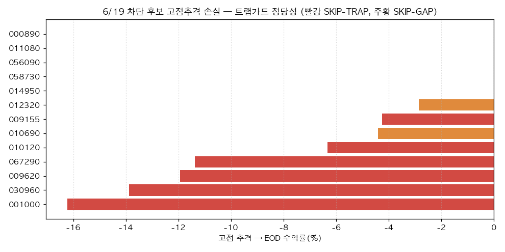
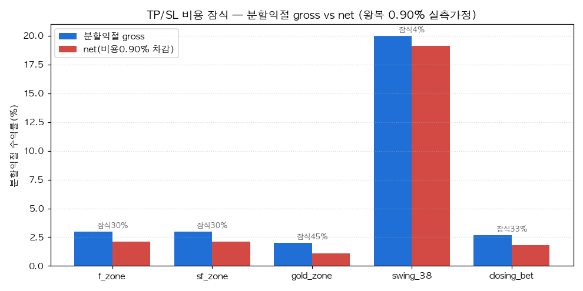

# 매매전략 고도화 — 매매시그널 상세체크 + TP/SL 구간 체크

> **Project**: BarroAiTrade · **Date**: 2026-06-21 · **Status**: Final (진단 + 측정도구 (c) 구현. 실거래 파라미터는 (d) HITL 미적용)
> **대상**: 방금 머지된 `trap_guard`(진입) + `regime_exit`(청산) 고도화. ①매매시그널 ②TP/SL 구간 2가지 상세체크.
> **연관**: [[2026-06-21-0619-trap-guard-simulation.report]] · [[2026-06-21-tp-sl-exit-logic.report]]

---

## 0. 요약 — 한 줄 결론

머지된 trap_guard·regime_exit는 **default-OFF·미측정**이었다. 두 측정 도구를 신설해 상세 점검한 결과:
- **신호**: 6/19 트랩 후보 13건을 게이트가 전부 차단(갭가드 7·트랩가드 6), **차단군을 장중 고점에 추격했다면 EOD까지 평균 −5.5%** → 차단 정당(개미꼬시기 포착). 단 09:30 추격 기준 +7.4%(일부 상승 지속) = **차단 무료 아님**(임계 측정 필수).
- **TP/SL**: 임계가 **전부 gross**라 비용(왕복 0.55~0.90%)이 잠식 — **gold_zone 분할익절 +2%는 비용이 45% 잠식**, SL은 net −4.9%. 6/16 실현 +13,862원은 전적으로 이월 supertrend 덕(sf_zone 대우건설 고갭 −181K). regime_exit 활성 시 SIDEWAYS SL −4→−3.

**(c) 즉시 구현 완료**: 측정도구 2개(`_signal_decision_audit.py`·`_tpsl_zone_diagnostic.py`) + trap SHADOW 모드 + 본 리포트. **(d) 실거래 파라미터 5종은 §5 권고 → AskUserQuestion 후 결정**(default 불변).

---

## 1. 점검 기준

| 항목 | 내용 |
|------|------|
| 신호 데이터 | **6/19**(트랩 풍부 무버, 5분봉 실측+일봉 합성). 6/19는 live-OFF라 실현 0 → 게이트 "결정"만 재현 |
| TP/SL 데이터 | **6/16**(실측 fill 존재) — `_daily_strategy_audit.py --source auto` 진실원천(total_realized +13,862 인용) |
| 측정 도구(신규, (c)) | `_signal_decision_audit.py`(게이트 replay+forward-return), `_tpsl_zone_diagnostic.py`(gross/net+regime) |
| 비용 가정 | 현행모델 왕복 0.55%(편도 0.175%) vs **6/17 실측 재분석 0.90%**(편도 0.350%, fill_audit 186건) 병행 |
| 안전 | 측정도구·SHADOW·regime_exit 모두 **default-OFF**(env/PolicyConfig 미설정 시 라이브 byte-identical) |

---

## 2. ① 매매시그널 상세체크 (trap_guard)

`_signal_decision_audit.py --date 2026-06-19 --movers 12` — 후보별 게이트 체인 재현 + forward-return.



| 종목 | 전략 | score | flu% | 윗꼬리 | pos930 | 판정 | 고점→EOD | 사유 |
|------|------|------:|-----:|-------:|-------:|------|--------:|------|
| 010120 | gold_zone | 0.79 | 7.0 | 3.50 | 80% | SKIP-TRAP | −6.3% | upper_wick 3.50 |
| 009620 | f_zone | - | 11.5 | 9.08 | 26% | SKIP-TRAP | −11.9% | upper_wick 9.08 |
| 067290 | f_zone | - | 13.1 | 1.13 | 60% | SKIP-TRAP | −11.4% | upper_wick 1.13 |
| 030960 | f_zone | - | 10.0 | 1.48 | 7% | SKIP-TRAP | −13.9% | upper_wick 1.48 |
| 001000 | f_zone | - | 8.4 | 2.19 | 6% | SKIP-TRAP | −16.2% | upper_wick 2.19 |
| 009155 | f_zone | - | 11.4 | 0.71 | 84% | SKIP-TRAP | −4.3% | over_ext 0.327 > 2.5×ATR |
| 010690·012320·… | f_zone | - | 16~30 | - | - | SKIP-GAP | 0~−4% | flu ≥ 15% |

**발견:**
1. **차단 정당성 입증**: 차단군 13건을 **장중 고점에 추격하면 EOD까지 평균 −5.5%**(001000 −16.2%·030960 −13.9%·009620 −11.9%). 윗꼬리·과확장 경고가 실제 페이드로 이어짐.
2. **실제 후보 010120**(gold_zone, score 0.79 — 6/19 sim 선정)도 윗꼬리 3.5x로 트랩가드 차단 → −6.3%. 전략 시그널 위에서 작동.
3. **단 09:30 추격 기준 차단군 +7.4%**(일부 상승 지속 + 상한가 5건 0%). 즉 **너무 이르게 차단하면 정상 모멘텀 손실** → 임계는 측정으로 손익분기 탐색(휩쏘 양날).
4. **관측성 공백 해소**: "왜 탈락했는지(어느 게이트)"를 집계하는 도구가 없었음 → 신규 audit로 차단율(갭가드 7·트랩 6)·forward-return 정량화.

---

## 3. ② TP/SL 구간 체크 (regime_exit + 비용)

`_tpsl_zone_diagnostic.py --date 2026-06-16` — 전략별 gross vs net + 국면 효과 + 실현 맥락.



| 전략 | grossTP | netTP(0.90%) | grossSL | netSL(0.90%) | 분할TP | **잠식%(0.90)** |
|------|--------:|------------:|--------:|------------:|------:|---------------:|
| f_zone | 5.0 | 4.10 | −4.0 | −4.90 | 3.0 | 30% |
| sf_zone | 7.0 | 6.10 | −4.0 | −4.90 | 3.0 | 30% |
| **gold_zone** | 4.0 | 3.10 | −4.0 | −4.90 | **2.0** | **45%** |
| swing_38 | 50.0 | 49.10 | −15.0 | −15.90 | 20.0 | 4.5% |
| closing_bet | 4.5 | 3.60 | −5.0 | −5.90 | 2.7 | 33% |

**regime_exit 효과**(예시배수 — 현재 default-OFF):

| 전략 | baseSL | SIDEWAYS_SL | baseTP | BULL_TP | BEARISH_SL |
|------|-------:|-----------:|-------:|--------:|----------:|
| f_zone | −4.0 | −3.00 | 5.0 | 6.50 | −5.00 |
| gold_zone | −4.0 | −3.00 | 4.0 | 5.20 | −5.00 |
| swing_38 | −15.0 | −11.25 | 50.0 | 65.00 | −18.75 |

**발견:**
1. **임계가 전부 gross** → 타이트한 분할익절일수록 비용 잠식 큼. **gold_zone +2% 분할익절은 0.90% 비용이 45% 잠식**(net +1.10%), f/sf +3%는 30%, closing +2.7%는 33%. SL도 net으로 ~0.9%p 더 깊다.
2. **비용 모델 2배 과소 → 정정 적용(✅)**: fill_audit **298행 재도출**으로 확정 — 수수료 1,768,040 / 왕복거래액(매수+매도) 505,588,092 = **편도 0.3497%**. fee 공식이 `(매수+매도)×COMMISSION_RATE`라 rate=0.0035 여야 하나 코드는 0.00175(절반). 종전 6/11 계산이 '왕복 0.3494%'를 편도로 오라벨 후 반감한 오류. **`COMMISSION_RATE` 0.00175→0.0035 정정**(시뮬/선정이 net 정확 반영 → 한계셋업 과매매 감소). 영향 테스트 6건 정정값 갱신.
3. **6/16 실현 맥락**(진실원천): f_zone +234,653 / sf_zone **−180,986**(대우건설 +20.6%갭 sf — sim −0.1만 → 실현 −18.1만 대괴리) / gold −12,673 / supertrend −27,132 / **total +13,862**(전적으로 이월 supertrend 덕). §C 손절슬립은 sf +0.13%p(작음 — 손실은 슬립 아닌 **진입가 위치**).
4. **regime_exit는 100% 무동작**(의도된 default-OFF). 6월 SIDEWAYS 변동성장엔 SL 타이트(−4→−3)가 후보지만, 노이즈 손절 다발(휩쏘) 위험 → 측정 후.

---

## 4. 신규 측정 도구 ((c) 안전 개선 — 즉시 구현)

| 도구 | 역할 | 안전성 |
|------|------|--------|
| `scripts/_signal_decision_audit.py` | 특정일 후보 게이트 체인 재현(SKIP-GAP/TRAP) + forward-return 검증 | 읽기·계산만, config 무변경 |
| `scripts/_tpsl_zone_diagnostic.py` | 전략별 gross vs net(2 비용가정) + regime_exit 효과 + 실현 맥락 인용 | 읽기·계산만 |
| `intraday_buy_daemon.py` SHADOW 모드 | env `BARRO_TRAP_SHADOW=1` → 트랩 "차단했을 것"만 로깅(미차단) → enforce 전 차단율 측정 | default-OFF(enforce), env 토글 |
| `regime_exit.apply_net_aware_tp` + `net_aware_tp_enabled` | TP/분할익절 비용 가산(net 익절) | config-gated default-OFF |
| `COMMISSION_RATE` 0.00175→0.0035 | 실측 2배 과소 정정(298행) | (d) 승인 적용 |
| 테스트 +14건 | net 변환·regime·net-aware·게이트 판정·default-OFF parity | 전체 **1496 통과** |

---

## 5. 권고 (분류 a/b/c/d · 우선순위)

| # | 권고 | 분류 | 우선 | 처리 |
|---|------|------|------|------|
| 1 | 측정도구 2개 + SHADOW 모드 + 본 리포트 | **(c)** | P0 | ✅ 구현·테스트 완료 |
| 2 | **수수료 요율 협의**(net 잠식 구조적 1순위 레버) | (a) 운영 | P0 | 사용자 액션(협의 후 `BARRO_COMMISSION_RATE`) |
| 3 | **`COMMISSION_RATE` 0.00175→0.0035 정정**(실측 2배) | (d)→승인 | P1 | ✅ **정정 적용**(298행 확정, 영향 테스트 6건 갱신). ops pull 시 시뮬/선정 net 정확화 |
| 4 | **trap_guard SHADOW 배포 측정**(wick 1.0·gap 15·k 2.5) | (d)→승인 | P1 | ✅ 코드 완비 → ops **SHADOW 런북**(아래). 측정 후 enforce |
| 5 | **regime_exit 활성화 + SIDEWAYS SL×0.75** | (d)→승인 | P1 | ✅ config-gated 완비 → ops **policy.json 런북**(아래). 코드 default 는 OFF 유지 |
| 6 | **net-aware TP/SL**(gold 분할 +2%→비용가산) | (d)→승인 | P2 | ✅ **구현**(config-gated default-OFF, `net_aware_tp_enabled`) |
| 7 | SL 격차(−2 백테 vs −4 라이브) 통일 | (d) | P2 | 측정 후(슬립 +0.13%p·STOP_LOSS<20%라 재검토 트리거 미달) |
| 8 | 갭가드 `_ZONE_MAX_FLU`(15%) | (b) 이미구현 | — | 배포됨(env 토글) |

### 운영(ops) 런북 — 승인된 (d) 활성화

> 코드 default 는 모두 OFF(라이브 byte-identical). 아래는 **운영 머신 설정**(이 개발머신 미적용).

**① 비용율 정정**: `git pull origin main` 만으로 적용(코드 default 0.0035). 우대요율 협의 시 `BARRO_COMMISSION_RATE` 로 하향.

**② trap_guard SHADOW 측정**(1~2주, 미차단): `.env.local` 에
```bash
BARRO_TRAP_UPPER_WICK_MAX=1.0
BARRO_TRAP_OVER_EXT_K_ATR=2.5
BARRO_TRAP_GAP_ATR_MULT=3.0
BARRO_TRAP_GAP_ABS_MAX_PCT=15.0
BARRO_TRAP_SHADOW=1        # 차단했을 것만 로깅(미차단). 측정 후 0 으로 enforce
```
로그의 `[SHADOW-TRAP]` 빈도·forward 결과로 차단율·오차단 측정 → 그 후 `BARRO_TRAP_SHADOW=0`.

**③ regime_exit 활성화**: `data/policy.json` 에(또는 `/tune`)
```json
{ "regime_exit_enabled": true, "regime_sideways_sl_mult": 0.75, "regime_bull_tp_mult": 1.3 }
```
(daemon 이 `refined_signals.json` 당일 regime 산출 → evaluate_holdings 가 SIDEWAYS 시 SL −4→−3.) 휩쏘 위험 → `verify_eod_data`·`_daily_strategy_audit` 로 손절율 모니터.

**④ net-aware TP**: `data/policy.json` 에 `{ "net_aware_tp_enabled": true }` (TP/분할익절 +0.9% gross-up → net 익절).

---

## 6. 한계 / 주의

- **개발머신 키움 인증 없음**: §B 진입품질 캔들 fetch 인증실패(정상) → 일중위치는 5분봉 합성으로 보완. 일봉캐시 6/18까지 → 6/19 일봉 5분봉 합성.
- **6/19 live-OFF**: 실현 거래 0 → 신호 "결정"만(forward-return로 정당성 검증). 실현 TP/SL은 6/16.
- **시뮬은 EOD 완성 일봉 기준**(post-hoc): 라이브 데몬은 장중 형성 중 일봉으로 판정 → SHADOW 모드로 실제 차단율 측정 필요.
- **임계 예시값**: trap k=2.5·wick 1.0, regime ×0.75/×1.3은 illustrative. **활성화 전 SHADOW/백테스트 측정 필수**(휩쏘 양날).
- **(d) 전부 HITL**: §5 #3~6은 AskUserQuestion 승인 전 default 불변. 본 increment은 (c)만 자동.
- 코드: 워크트리 `feat/thetrading-uplift-increment1`, **미커밋**(커밋/푸시는 승인 후).
