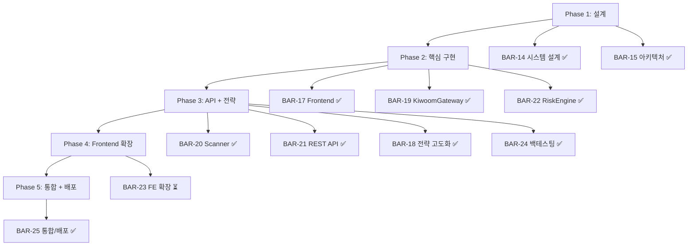

# WBS: BarroAiTrade 시스템 구현 계획

> BAR-26 기반 | [[issue-board|Issue Board]] 참조

---

## 전체 WBS 구조



---

## 크리티컬 패스

```
BAR-19(Gateway) → BAR-20(Scanner) → BAR-21(API) → BAR-23(FE) → 완료
     ✅               ✅               ✅           ⏳
```

---

## Sprint 진행 상황

### Sprint 1 — 핵심 인프라 ✅ 완료
| 이슈 | 담당 | 상태 |
|------|------|:----:|
| BAR-19 KiwoomGateway | Backend Engineer | ✅ |
| BAR-22 RiskEngine | Head of Risk | ✅ |

### Sprint 2 — API + 전략 ✅ 완료
| 이슈 | 담당 | 상태 |
|------|------|:----:|
| BAR-20 ScannerService | Backend Engineer | ✅ |
| BAR-21 REST API Routes | Backend Engineer | ✅ |
| BAR-24 백테스팅 엔진 | Head of Research | ✅ |

### Sprint 3 — Frontend 확장 ⏳ 진행 필요
| 이슈 | 담당 | 상태 |
|------|------|:----:|
| BAR-23 Watchlist/Reports/Settings | Frontend Engineer | ⏳ |

### Sprint 4 — 통합/배포 ✅ 완료
| 이슈 | 담당 | 상태 |
|------|------|:----:|
| BAR-25 시스템 통합 | CTO | ✅ |

---

## 남은 작업

- [ ] BAR-23: Frontend 3개 페이지 (Watchlist, Reports, Settings)
- [ ] BAR-28: 한국 주식 시장 분석 + 관심종목 리스트
- [ ] BAR-29: 백테스팅 전략 검증 리포트

---

*[[issue-board|← Issue Board]] | [[../00-index/status-dashboard|상태 대시보드]] | 최종 업데이트: 2026-04-11*
